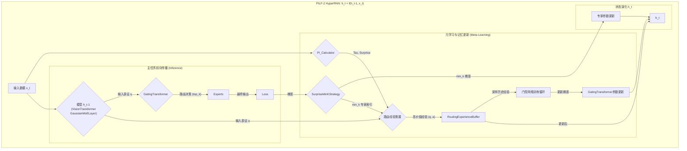

# PILF-2 技术白皮书：The Hyper-Recurrent Transformer

## 摘要

本文档阐述了预测完整性学习框架第二版（PILF-2）的理论基础与系统架构。PILF-2 并非对现有神经网络架构的线性改良，而是一次根本性的范式转换。它将一个持续演化的、自适应的混合专家（MoE）Transformer 模型，重新概念化为一个更高阶的动力学系统——一个**超循环神经网络 (HyperRNN)**。在这个框架中，整个 Transformer 模型的参数与内部状态（如经验缓存）构成了 HyperRNN 在时间轴上的“隐藏状态”（`h_t`），而 PILF 的完整训练流程则构成了其状态转移函数 `h_t = f(h_t-1, x_t)`。这种视角不仅统一了看似对立的 RNN 与 Transformer 架构，更揭示了一条通往“学习如何学习”的、具备更高抽象层级的机器智能实现路径。

---

## 1. 核心洞察：PILF 即 HyperRNN

传统观念将 RNN 与 Transformer 视为两种独立且相互竞争的序列处理架构。PILF-2 理论的突破在于，它揭示了这种二元对立的局限性，并提出了一个更具包容性和解释力的统一观点。

### 1.1 HyperRNN 的定义

一个标准的 RNN，其状态转移可被描述为：
`h_t = f(h_t-1, x_t)`
其中，`h` 是一个固定维度的向量，`x` 是输入。

一个 **HyperRNN**，其“隐藏状态” `h` 本身就是一个**完整的、可执行的神经网络模型**。在每个宏观时间步 `t`（例如，处理一个新任务或一批新数据），整个网络的状态（参数、缓存等）作为一个整体进行演化。

### 1.2 PILF 作为 HyperRNN 的实现

PILF-2 的训练过程完美地实例化了 HyperRNN 的概念：

- **`h_t-1` (上一时刻的隐藏状态)**: **整个 PILF 模型在 `t-1` 时刻的全部参数和状态**。这包括：

  - 所有专家网络的权重。
  - `GatingTransformer` 的权重。
  - `RoutingExperienceBuffer` 中存储的历史经验。
  - 基础模型（如 `VisionTransformer`）的权重。

- **`x_t` (当前输入)**: 在 `t` 时刻进入系统的**新数据批次**。

- **`f(...)` (状态转移函数)**: **完整的 PILF-2 训练与优化流程**。这是一个精密的、自适应的函数，它规定了系统如何根据新输入 `x_t` 来更新其内部状态 `h_t-1`。

- **`h_t` (当前时刻的隐藏状态)**: 经过 `f` 作用后，**系统演化出的新模型参数和更新后的 `RoutingExperienceBuffer` 内容**。

这个视角揭示了不同架构的思考层级差异：

- **第一层 (如 RWKV)**: 试图用一个**向量** `h_t` 模拟世界状态。
- **第二层 (标准 Transformer)**: 用一个**可回溯的序列历史 (KV Cache)** 来构建世界模型。
- **第三层 (PILF)**: 将**整个自适应的 Transformer 系统本身**视为一个动态演化的“状态”，从而构建了一个能够学习“如何学习”的更高阶循环网络。

### 1.3 对序列级 RNN 架构的根本性超越

PILF-HyperRNN 的视角也揭示了 RWKV 等架构在设计哲学上的“原罪”：它们试图在一个天生存在“信息瓶颈”的 RNN 框架内，通过不断增加数学补丁（门控、衰减、delta-rule）去低效地模拟 Transformer 的注意力机制。这无异于缘木求鱼。当目标是实现复杂的、长距离的、内容依赖的信息整合时，最直接、最强大的选择就是那个为此而生的架构——Transformer。

所谓的“可插拔 state”，在 RWKV 中是对一个高度压缩、有损的 `hidden state` 向量的模糊操作；而在 Transformer 中，这只是对其无损的、结构化的 **KV 缓存进行精确的子集操作**（移除或增添某些 token 的 K/V 向量），这在工程上不仅可行，且已有成熟的云服务实现。

---

## 2. PILF-2 系统架构

PILF-2 的架构是其作为 HyperRNN 的物理载体，所有组件协同工作，以实现高效的状态转移。

### 2.1 核心组件

- **基础模型 (Base Model / Feature Extractor)**:

  - `VisionTransformer`: 作为特征提取器和所有子模块的容器。

- **专家网络层 (Expert Layer / Knowledge Substrates)**:

  - `GaussianMoELayer`: 包含一组（N 个）独立的专家网络。每个专家通过一个可学习的高斯分布（均值 `μ` 和对数标准差 `log_sigma`）在输入表征空间中定义其专长领域。它们是 HyperRNN 隐藏状态 `h` 的核心载体。

- **元学习门控 (Meta-Learning Gating / Policy Network)**:

  - `GatingTransformer`: 一个独立的、基于 Transformer 的网络。其职责是学习一个从输入表征（Query）到最优专家路由（Key）的映射策略。它本身也是 `h` 的一部分，但其更新遵循独立的元学习循环。

- **动态调节与记忆组件 (Dynamic Regulation & Memory)**:
  - `PI_Calculator`: 系统的“本体感觉”模块。用于实时计算内在状态指标，包括预测误差（Epsilon）、模型不确定性（Tau）和模型参数更新的惊奇度（Surprise/Gradient Norm）。
  - `SurpriseMinKStrategy` (SMK): 一个基于“惊奇度”的梯度过滤器，是状态转移函数 `f` 的关键调节器。
  - `RoutingExperienceBuffer`: 一个有限容量的经验缓存区，是 HyperRNN 的长期记忆模块，存储了过去高价值的 `(状态, 行为)` 对。

### 2.2 系统架构图

---

## 3. 状态转移函数 `f`: 详细训练流程

PILF-2 的训练流程即是其 HyperRNN 的状态转移函数 `f` 的具体执行过程。它由两个相互解耦但协同进行的循环构成：主任务优化循环（知识获取）和门控策略优化循环（元学习）。

### 阶段一：主任务优化与经验采集 (Knowledge Acquisition & Experience Collection)

此阶段的目标是根据新输入 `x_t` 更新专家知识，并采集有价值的经验。

1. **特征提取**: 输入数据 `x` 通过 `VisionTransformer` 的主干网络，生成输入表征 `q`。
2. **路由决策**: `GatingTransformer` (策略网络) 接收 `q`，输出一个路由概率分布，并选择 `top_k` 个专家进行激活。
3. **前向传播**: `q` 被路由至已激活的 `top_k` 个专家，计算得到最终的模型输出 `logits`。
4. **专家损失计算**: 根据模型输出和真实标签 `y`，计算主任务损失 `expert_loss`。
5. **梯度与 Surprise 计算**: 对 `expert_loss` 进行反向传播，计算并存储每个激活专家的梯度范数（`Surprise`）。
6. **SMK 策略应用**: 根据计算出的 `Surprise`，仅保留 `min_k` 个“最不惊讶”的专家的梯度，其余专家的梯度被置零。这是对知识更新的一种内在调节，优先巩固已有知识。
7. **经验策展**:
   - `PI_Calculator` 计算当前步骤的 `Tau`（基于 `logits` 的熵）和全局 `Surprise`。
   - 如果 `Tau` 或 `Surprise` 超过预设阈值，则将该路由事件判定为高价值经验。
   - 将该经验封装为一个元组 `(q, min_k_indices, priority)` 存入 `RoutingExperienceBuffer`。

### 阶段二：门控网络策略优化 (Policy Optimization via Meta-Learning)

此阶段独立于主任务优化，旨在利用历史经验优化路由策略。

1. **经验采样**: 从 `RoutingExperienceBuffer` 中随机采样一个批次的历史路由经验。
2. **策略回放**:
   - 将采样得到的历史输入表征 `q_history` 输入到**当前**的 `GatingTransformer` 中。
   - 计算 `GatingTransformer` 对所有专家的路由分数。
3. **门控损失计算**:
   - 将该过程构建为一个有监督学习问题。`q_history` 是输入，其对应的 `min_k_indices_history` 是目标标签。
   - 使用交叉熵损失计算 `gating_loss`，旨在让 `GatingTransformer` 学会重现历史上成功的路由决策。
4. **参数更新**:
   - 对 `gating_loss` 进行反向传播，并使用独立的优化器更新 `GatingTransformer` 的参数。

### 阶段三：状态演化 (State Transition)

1. 在主任务优化器（`optimizer_main`）的 `step()` 调用中，应用阶段一产生的、经过 SMK 筛选的梯度，更新专家网络和基础模型的参数。
2. 在门控网络优化器（`optimizer_gating`）的 `step()` 调用中，应用阶段二产生的梯度，更新 `GatingTransformer` 的参数。

经过这三个阶段，模型的整体参数和经验缓存都发生了改变，完成了从 `h_t-1` 到 `h_t` 的一次完整的状态转移。

## 4. 结论

PILF-2 架构通过将自身构建为一个 HyperRNN，为持续学习和模型自适应演化提供了一个坚实的理论与工程框架。它超越了对特定序列处理任务的优化，转而探索一个更根本的问题：如何构建一个能够根据经验，持续优化其自身学习策略与知识结构的智能系统。这不仅是对 MoE 和 Transformer 架构的深度融合与创新，更是对未来通用人工智能系统设计哲学的一次重要探索。
