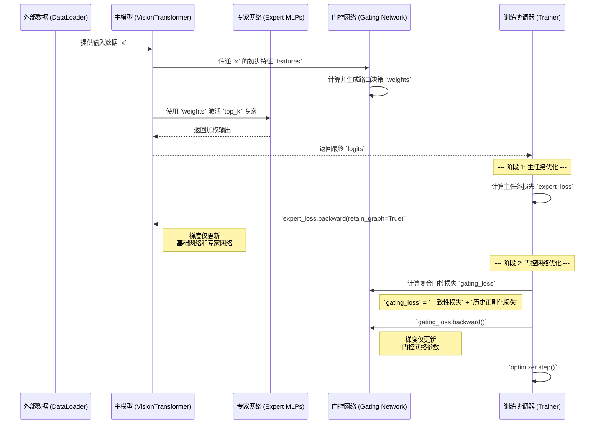

# PILF 架构蓝图 (PILF Architecture Blueprint)

## 1. 简介 (Introduction)

### 1.1. 理论基础: 整合预测工作空间理论 (IPWT)

- **核心思想**: IPWT 的核心思想可概括为一个持续循环的动态过程，它整合了三大理论的核心机制：
  1. **采纳 PCT/FEP 作为动力学引擎**: 意识过程本质上是预测驱动的。
  2. **采纳并扩展 WT 作为架构平台**: 将全局工作空间泛化为可动态生成的 **Workspace Instance**。
  3. **对 IIT 进行功能性重构**: 用信息论中的“**Synergy 的逻辑不可约性**”来重新定义“整合”。
- **关键度量**:
  - **瞬时信息整合度 (Ωₜ)**: `Ωₜ(X → Y) = S(X...; Y) / I(X...; Y)`，理论上的“黄金标准”，衡量信息整合的协同程度。
  - **预测完整性 (PI)**: `PIₜ = exp(-α · ((1 - γ) · εₜ / τₜ + γ · Surpriseₜ))`，计算上高效的“功能性代理”，用于实时监控模型的认知健康度。

### 1.2. 框架目标: 预测完整性学习框架 (PILF)

- **核心任务**: 将 IPWT 理论付诸实践的工程蓝图和机器学习分析框架，旨在探索并实现能够有效**对抗灾难性遗忘**的机制，以支持**永续预训练 (Perpetual Pre-training)** 和**持续性学习 (Continual Learning)**。
- **设计哲学**: **用动态的、数据驱动的策略取代静态的、人为设定的规则**。通过实时评估每一批次数据带来的 `Surprise`（惊奇度），动态地、按比例地调整其学习行为。

## 2. 架构总览 (Architecture Overview)

### 2.1. 核心工作流: 解耦优化



### 2.2. 数据流

- (将在后续步骤中填充 Mermaid 数据流图)

## 3. 核心组件详述 (Core Component Specification)

### 3.1. 基础模型 (Base Model)

- **`VisionTransformer`**

  - 职责: 特征提取器与组件容器。
  - API (推断):

        ```python
        import torch.nn as nn

        class VisionTransformer(nn.Module):
            def __init__(self):
                super().__init__()

            def forward(self, x):
                pass
        ```

### 3.2. 专家网络层 (Expert Layers)

- **`GaussianMoELayer`**

  - 职责: 参数化为高斯分布的专家网络。
  - API (推断):

        ```python
        import torch.nn as nn

        class GaussianMoELayer(nn.Module):
            def __init__(self):
                super().__init__()

            def forward(self, x):
                pass
        ```

- **`MemoryGaussianMoELayer` (MGM)**

  - 职责: 承载 Gating Transformer 并维护“错题本”。
  - API (推断):

        ```python
        import torch
        import torch.nn as nn

        class MemoryGaussianMoELayer(nn.Module):
            def __init__(self):
                super().__init__()

            def forward(self, x):
                pass

            def update_memory(self, q_embedding: torch.Tensor, min_k_indices: torch.Tensor, priority: torch.Tensor):
                pass

            def decay_memory(self):
                pass
        ```

### 3.3. 元学习门控 (Meta-Learning Gating)

- **`GatingTransformer`**

  - 职责: 实现基于历史经验的动态路由。
  - API (推断):

        ```python
        import torch.nn as nn

        class GatingTransformer(nn.Module):
            def __init__(self):
                super().__init__()

            def forward(self, query, key, value):
                pass
        ```

### 3.4. 动态调节组件 (Dynamic Regulation Components)

- **`PI_Calculator`**

  - 职责: 计算 Epsilon, Tau, Surprise, 和 PI Score。
  - API (推断):

        ```python
        import torch

        class PICalculator:
            def calculate(self, loss: torch.Tensor, logits: torch.Tensor, model_params) -> dict:
                return {}
        ```

- **`SurpriseMinKStrategy` (SMK)**

  - 职责: 识别 Surprise 最低的专家。
  - API (推断):

        ```python
        import torch

        class SurpriseMinKStrategy:
            def get_min_k_indices(self, experts) -> torch.Tensor:
                return torch.empty(0)
        ```

- **`PILRStrategy`**

  - 职责: 动态调节学习率。
  - API (推断):

        ```python
        import torch

        class PILRStrategy:
            def adjust_lr(self, optimizer, pi_metrics: dict):
                pass
        ```

## 4. 关键算法伪代码 (Key Algorithm Pseudocode)

### 4.1. 两阶段优化训练循环 (Two-Stage Optimization Loop)

_注意: 以下为高级伪代码，用于说明逻辑流程，省略了部分实现细节。_

```python
for epoch in epochs:
    for batch in dataloader:
        # --- 阶段 1: 主任务优化 ---
        optimizer.zero_grad()

        # 前向传播，获取主任务 logits
        final_logits = model(batch.x)

        # 计算主任务损失
        expert_loss = cross_entropy_loss(final_logits, batch.y)

        # 保留计算图，为阶段2做准备
        expert_loss.backward(retain_graph=True)

        # --- 阶段 2: 门控网络优化 ---

        # 计算门控网络损失（具体实现取决于策略）
        gating_loss = model.moe_layer.calculate_gating_loss(...)

        # 仅对门控网络参数进行反向传播
        gating_loss.backward()

        # --- 更新所有参数 ---
        optimizer.step()

        # --- （可选）更新“错题本” ---
        model.moe_layer.update_memory(...)
```

### 4.2. “错题本”更新与衰减机制 (History Buffer Update & Decay)

_注意: 以下为高级伪代码，用于说明逻辑流程，省略了部分实现细节。_

```python
class MemoryGaussianMoELayer:
    def __init__(self, buffer_size, priority_decay):
        self.buffer = [] # 存储 (q_embedding, min_k_embedding, priority)
        self.buffer_size = buffer_size
        self.priority_decay = priority_decay

    def update_memory(self, q_embedding, min_k_indices, tau_values):
        # 将 min_k_indices 转换为 embedding
        min_k_embedding = self.expert_embeddings(min_k_indices)

        for i in range(len(q_embedding)):
            priority = tau_values[i]

            if len(self.buffer) < self.buffer_size:
                self.buffer.append((q_embedding[i], min_k_embedding[i], priority))
            else:
                # 找到缓冲区中优先级最低的样本
                min_priority_index = min(range(len(self.buffer)), key=lambda j: self.buffer[j][2])

                # 如果新样本的优先级更高，则替换
                if priority > self.buffer[min_priority_index][2]:
                    self.buffer[min_priority_index] = (q_embedding[i], min_k_embedding[i], priority)

    def decay_memory(self):
        # 在每个 epoch 开始时调用
        for i in range(len(self.buffer)):
            q, m, p = self.buffer[i]
            self.buffer[i] = (q, m, p * self.priority_decay)
```
