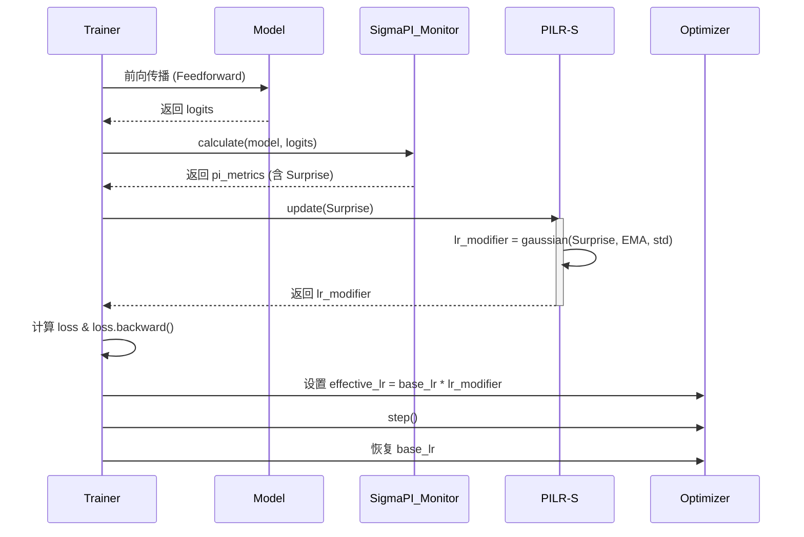
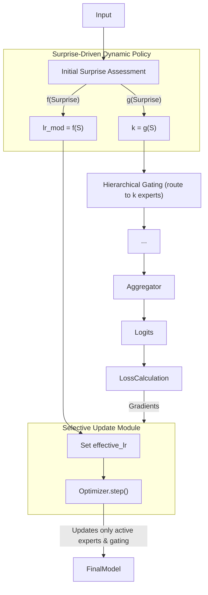

# **技术笔记：PILF (Predictive Integrity Learning Framework) 框架**

**文档版本:** 3.0

**核心理念:** 一个旨在将固定的超参数（如学习率、模型容量）转变为由数据内在“惊奇度”(`Surprise`)实时驱动的动态策略的认知学习框架。其本质是一种**自适应超参数调度算法**，它让模型根据学习内容的价值，自主决定“学多少”和“用多大容量学”。该框架源于 IPWT (Integrated Predictive Workspace Theory) 理论，相关论文信息请见 https://github.com/dmf-archive/IPWT。

---

## **1. 设计哲学：从“固定规则”到“动态策略”**

传统训练范式依赖于手动设定的、在整个训练过程中通常固定或按预定计划衰减的超参数（如学习率）。这种“一刀切”的方法忽略了不同数据批次所包含的学习价值的巨大差异。

PILF 的设计哲学是：**用动态的、数据驱动的策略取代静态的、人为设定的规则**。

它不再盲目地使用固定的学习率或固定的模型容量，而是通过实时评估每一批次数据带来的 `Surprise`，动态地、按比例地调整其学习行为：

1. **动态学习率 (Dynamic Learning Rate)**: 当 `Surprise` 适中时，意味着遇到了有价值的“可学习区”信息，系统会分配较高的学习率；当 `Surprise` 过低（冗余信息）或过高（异常信息）时，则分配接近于零的学习率，从而自然地实现了“忽略”和“拒绝”的效果。**这直接取代了手动设定的学习率调度器**。
2. **动态容量 (Dynamic Capacity)**: 在 MoE 架构中，`Surprise` 不仅调节学习率，还决定了需要激活的“专家”数量 `k`。简单的任务 (`Surprise` 低) 只需少数专家，而复杂的任务 (`Surprise` 高) 则会动态调动更多专家参与。**这取代了固定的 Top-K 路由**。

---

## **2. 核心实现：从 PILR-S 到 PILF**

### **阶段一：PILR-S (预测完整性驱动的学习率调度器)**

PILR-S 是 PILF 思想在**任何标准神经网络**上的直接应用。它只关注一个问题：**如何根据 `Surprise` 动态调整学习率？** 在 [SigmaPI](https://github.com/dmf-archive/SigmaPI) 上可以找到一个初步的模型动物园和预测完整性计算工具包的实现。

它取代了传统的 `optimizer.step()` 是否执行的“门控”逻辑，演变为一个平滑的、连续的学习率调制器。

**机制详解:**

1. **`Surprise` 计算**: 在一次廉价的**前向传播 (Feedforward)** 后，`ΣPI` 监视器便可计算出当前批次的 `Surprise`。这个过程无需等待昂贵的反向传播，实现了对学习价值的快速评估。
2. **动态调制**: PILR-S 模块接收 `Surprise`，并根据其与 `Surprise` 的指数移动平均（EMA）和标准差（std）的关系，通过一个高斯函数 `exp(-0.5 * ((surprise - mu) / sigma)^2)` 计算出一个平滑的调制因子 `lr_modifier` (范围在0到1之间)。
3. **权重更新**: 在计算出 `lr_modifier` 后，才执行标准的 `loss.backward()`。随后，`optimizer` 使用 `effective_lr = base_lr * lr_modifier` 来执行权重更新。`optimizer.step()` **总是被执行**，但其更新的幅度已被 `Surprise` 预先动态缩放。

### **阶段二：PILF (完全体 - 动态学习率 + 动态容量)**

PILF 是在 MoE 架构上的完全实现，它将动态调度思想扩展到了模型容量的分配上。

**训练循环详解:**

1. **双重动态决策**: 模型接收数据，计算一个初始 `Surprise`。基于此 `Surprise`，PILF 并行做出两个决策：
    - **容量决策**: `k = g(Surprise)`，决定激活多少专家。
    - **学习率决策**: `lr_modifier = f(Surprise)`，决定学习的强度。
2. **动态路由与计算**: 门控网络根据 `k` 值将任务路由到最合适的专家。
3. **动态权重更新**: 计算损失和梯度后，优化器使用由 `lr_modifier` 调制后的有效学习率，**仅对被激活的专家和门控网络**进行更新。

---

## **3. 理论贡献**

- **变超参数为策略**: 将学习率和模型容量从开发者设定的“静态超参数”转变为模型根据数据价值自主调节的“动态策略”。
- **统一“学习”与“遗忘”**: 通过将学习率与 `Surprise` 挂钩，PILF 提供了一个统一的框架来处理学习、忽略（低`Surprise`导致低`lr`）和拒绝（高`Surprise`导致低`lr`），从而内在地缓解了灾难性遗忘。
- **计算资源按需分配**: (PILF) 实现了真正的按需计算，简单的任务消耗极少资源，复杂的任务则动态调用更多资源，极大提升了效率。

---

## **4. 演进路径**

- **阶段一：PILR-S (动态学习率)**
  - **目标:** 在任何标准模型上，用 `Surprise` 驱动的动态学习率取代固定的学习率调度器。
  - **核心机制:** `effective_lr = base_lr * f(Surprise)`。
  - **优势:** 无需修改模型架构，可作为现有训练流程的直接替代品，快速验证动态策略的有效性。

- **阶段二：PILF (动态学习率 + 动态容量)**
  - **目标:** 在 MoE 架构上实现一个完全自适应的认知系统。
  - **核心机制:** `k = g(Surprise)` 和 `effective_lr = base_lr * f(Surprise)` 并行运作。
  - **优势:** 实现了计算效率和模型容量扩展性的最大化。

---

本作品采用[知识共享署名-非商业性使用-相同方式共享 4.0 国际许可协议](http://creativecommons.org/licenses/by-nc-sa/4.0/)进行许可。
