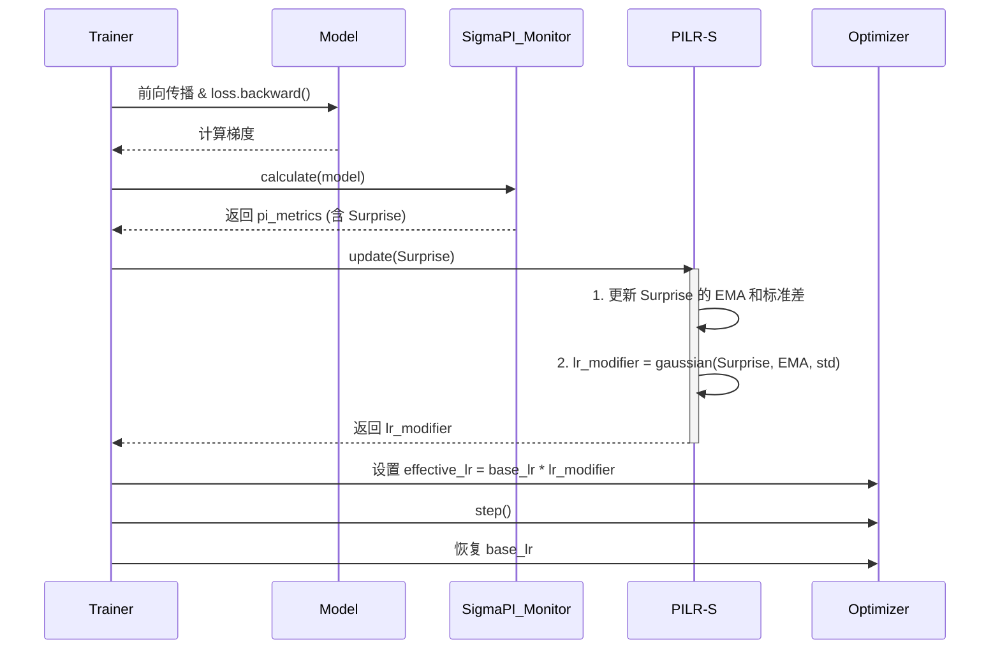

# **技术笔记：PILR-S (Predictive Integrity-driven Learning Rate Scheduler)**

**文档版本:** 2.0
**核心理念:** PILR-S 是将固定的学习率（Learning Rate）转变为由数据内在“惊奇度”(`Surprise`)实时驱动的动态策略。其本质是一种**自适应学习率调度算法**，它让模型根据学习内容的价值，自主决定“学多少”，从而取代了手动设定的、静态的 LR Schedulers。

---

## **1. 设计哲学：从“固定步长”到“动态步幅”**

传统训练范式依赖于手动设定的、在整个训练过程中通常固定或按预定计划衰减的学习率。这种“一刀切”的方法忽略了不同数据批次所包含的学习价值的巨大差异。

PILR-S 的设计哲学是：**用动态的、数据驱动的策略取代静态的、人为设定的规则**。

它不再盲目地使用固定的学习率，而是通过实时评估每一批次数据带来的 `Surprise`，动态地、按比例地调整其学习步幅：

- 当 `Surprise` 适中时，意味着遇到了有价值的“可学习区”信息，系统会分配较高的学习率。
- 当 `Surprise` 过低（冗余信息）或过高（异常信息）时，则分配接近于零的学习率，从而自然地实现了“忽略”和“拒绝”的效果。

**这直接取代了手动设定的学习率调度器。**

---

## **2. 核心机制：连续学习率调制器**

PILR-S 的核心是一个平滑的、连续的学习率调制器，它取代了过去“是否执行 `optimizer.step()`”的二元门控逻辑。

**机制详解:**

1. **`Surprise` 计算**: 标准的前向和后向传播后，`ΣPI` 监视器计算当前批次的 `Surprise`。
2. **动态调制**: PILR-S 模块接收 `Surprise`，并根据其与 `Surprise` 的指数移动平均（EMA）和标准差（std）的关系，通过一个高斯函数 `exp(-0.5 * ((surprise - mu) / sigma)^2)` 计算出一个平滑的调制因子 `lr_modifier` (范围在 0 到 1 之间)。
3. **权重更新**: `optimizer` 使用 `effective_lr = base_lr * lr_modifier` 来执行权重更新。`optimizer.step()` **总是被执行**，但更新的幅度被 `Surprise` 动态缩放。
4. **学习率恢复**: 在下一次迭代开始前，优化器中的学习率被恢复为 `base_lr`，以确保 `lr_modifier` 的效果不会累积。

---

## **3. 理论贡献**

- **变超参数为策略**: 将学习率从开发者设定的“静态超参数”转变为模型根据数据价值自主调节的“动态策略”。
- **统一“学习”与“遗忘”**: 通过将学习率与 `Surprise` 挂钩，PILR-S 提供了一个统一的框架来处理学习、忽略（低`Surprise`导致低`lr`）和拒绝（高`Surprise`导致低`lr`），从而内在地缓解了灾难性遗忘。
- **实现简单，通用性强**: 无需修改模型架构，可作为现有训练流程的直接替代品，快速验证动态策略的有效性。
