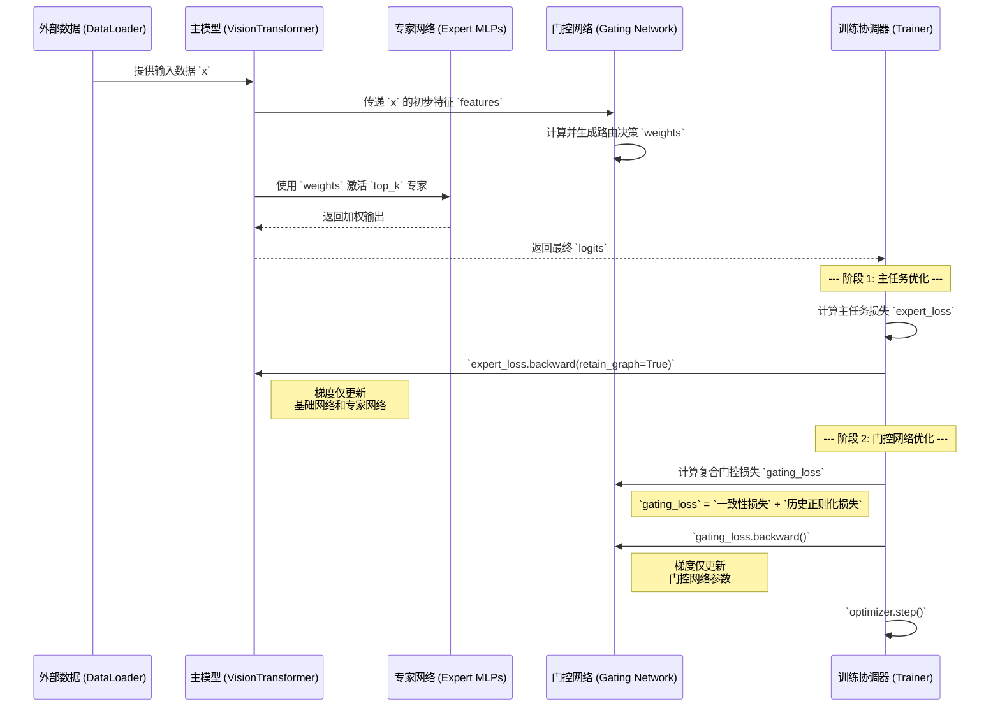

# PILF 组件技术参考

## 1. 框架目标与设计

**预测完整性学习框架 (Predictive Integrity Learning Framework, PILF)** 是一个受整合预测工作空间理论 (IPWT) 启发的学习框架。其核心研究目标是探索并实现能够有效**对抗灾难性遗忘**的机制，以支持**永续预训练 (Perpetual Pre-training)** 和**持续性学习 (Continual Learning)**。

为此，PILF 框架的设计遵循以下原则：

- **动态策略**: 将固定的超参数（如学习率）替换为由模型内在状态（如梯度范数、输出熵）驱动的动态调节机制。
- **模块化实现**: 将不同的学习策略（如路由、更新、学习率调整）实现为可独立测试、验证和组合的组件。当前的实现是为验证这些组件有效性而设计的实验平台。

## 2. 核心工作流：解耦优化的训练循环

PILF 的核心工作流围绕一个两阶段、解耦的优化过程展开。此设计旨在将主任务的学习（由专家网络执行）与路由策略的学习（由门控网络执行）分离开来。

## 3. 核心组件详解

### 3.1. 模型架构 (`models/`)

- **`VisionTransformer` (`base_vit.py`)**: 基础模型架构，负责初步的特征提取，并作为专家网络和门控网络的容器。
- **`GaussianMoELayer` (`moe_layers.py`)**: MoE 专家网络的一种实现。每个专家被参数化为一个高斯分布（由可学习的 `expert_mus` 和 `expert_log_sigmas` 定义），代表其知识域的中心和范围。路由基于输入与专家分布的概率密度进行。

### 3.2. 动态调节组件 (`utils/strategies/`)

- **`PI-Calculator` (`pi_calculator.py`)**: 计算模型在每个步骤的内在状态指标。它输出三个核心度量：`Epsilon` (误差), `Tau` (输出熵), 和 `Surprise` (梯度范数)，并最终组合成 **PI Score**，为其他策略组件提供决策依据。
- **`SurpriseMinKStrategy` (SMK)**: 一种反向传播掩码生成策略。在主任务反向传播后，该策略独立计算每个专家的 `Surprise`（梯度范数），并识别出 `Surprise` 最低的 `min_k` 个专家。此信息用于后续的门控损失计算。
- **`PILRStrategy`**: 一种学习率调节策略。它根据全局 `PI Score` 或 `Surprise`，为优化器中不同的参数组（`base`, `gating`, `experts`）计算并应用独立的学习率调节系数。

### 3.3. 元学习门控 (`Gating Network`)

这是 PILF 框架的核心研究目标，旨在从静态路由演进为动态的元学习路由。

- **`Gating Transformer`**:
  - **定位**: 一个独立的**交叉注意力网络**，作为 `MemoryGaussianMoELayer` 的核心组件，用于实现排演学习（Rehearsal Learning）。
  - **输入 (Cross-Attention)**:
    1. **查询 Q (Query)**: 来自 `VisionTransformer` 的当前批次特征 `x_flat`，代表“当前待解决的任务是什么？”。
    2. **键 K (Key)**: 来自“错题本”的历史 `q_embedding`，代表“过去哪些任务是困难的？”。
    3. **值 V (Value)**: 来自“错题本”的历史 `min_k_embedding`，代表“对于过去的难题，哪些知识是相关的？”。
  - **功能**: 通过拿当前任务(`Q`)去查询历史难题(`K`)，并根据匹配度加权聚合相关的历史知识(`V`)，`Gating Transformer` 生成一个`context_vector`。该向量与原始的门控`logits`相加，从而将历史经验动态地融入当前的路由决策中。

- **`MemoryGaussianMoELayer` (MGM)**:
  - **定位**: 一个带有“错题本”机制的专家网络层，用于支持 `Gating Transformer` 的排演学习。
  - **核心职责**:
    - **承载 `Gating Transformer`**: 将其作为动态路由决策的一部分。
    - **维护“错题本” (History Buffer)**:
      - **内容**: 存储一个由 `(q_embedding, min_k_embedding, priority)` 组成的元组序列。`priority` 由该样本的 `tau` (模型困惑度)决定。
      - **机制**: 这是一个基于优先级的固定长度队列。只有当新样本的 `tau` 高于缓冲区中最低的 `tau` 时，才会替换掉最低的样本。
      - **优先级衰减**: 每个 `epoch` 开始时，所有存储样本的 `priority` 都会按一个固定的衰减率 (`priority_decay`) 进行衰减，防止旧的、已解决的“错题”永久占据缓冲区。

### 3.4. 专用训练引擎 (`utils/train_loops/`)

- **`GaussianTrainLoop`**: 为 `GaussianMoELayer` 设计的训练引擎，实现了两阶段反向传播。
- **`MGMTrainLoop`**: 为 `MemoryGaussianMoELayer` 设计的专用训练引擎。
  - **核心流程**:
    1. 在每个 `epoch` 开始时，调用 `decay_memory()` 对“错题本”中的优先级进行衰减。
    2. 在主任务反向传播后，计算 `pi_metrics`（特别是`tau`）和 `min_k_indices`。
    3. 调用 `update_memory()` 方法，将当前批次的 `q_embedding`、`min_k_indices` 和 `tau` 传入“错题本”。
    4. 使用 `CompositeGatingLoss` 计算门控损失。该损失函数结合了由 `SMK` 策略提供的**路由一致性损失**和由 `GatingTransformer` 提供的**排演学习损失**。
