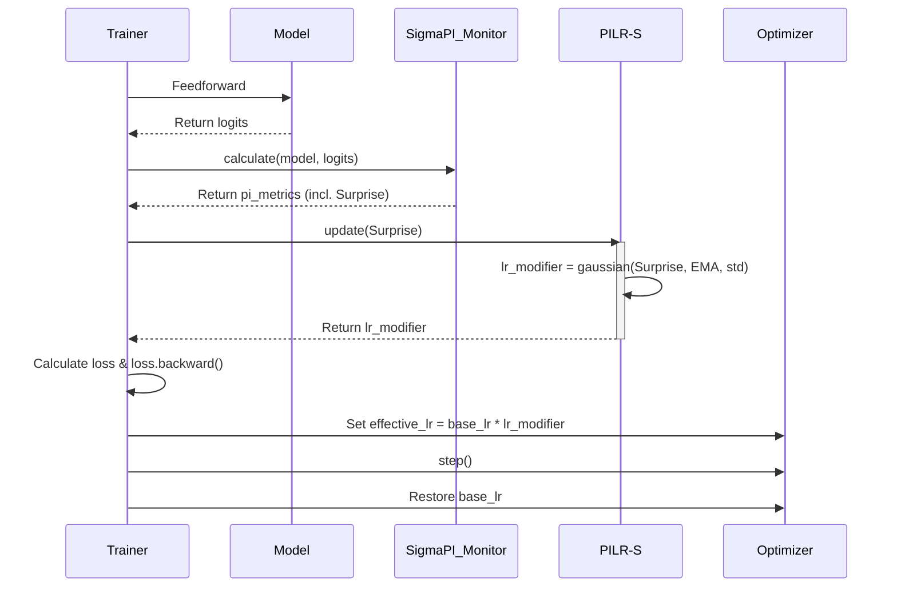
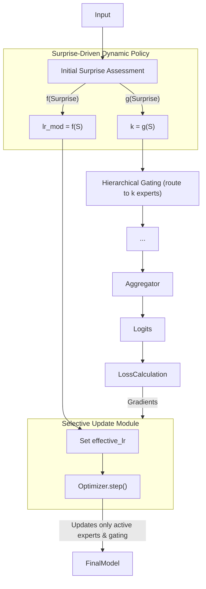
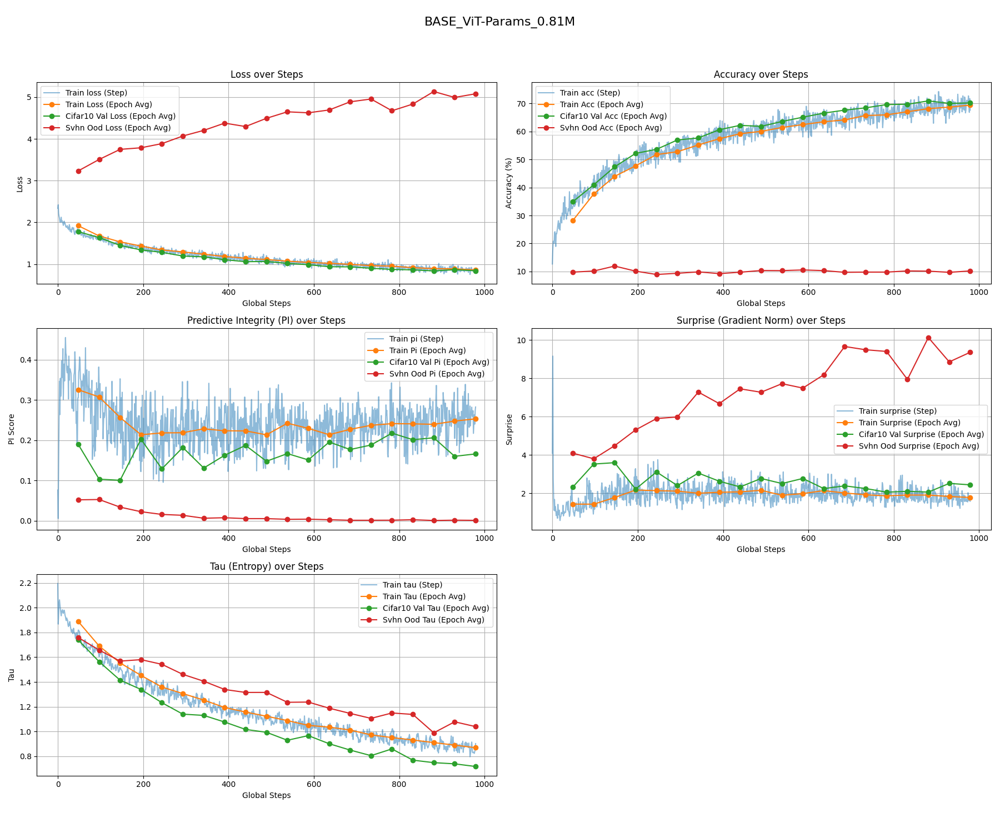
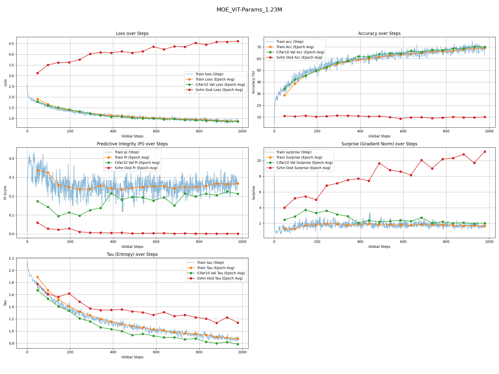
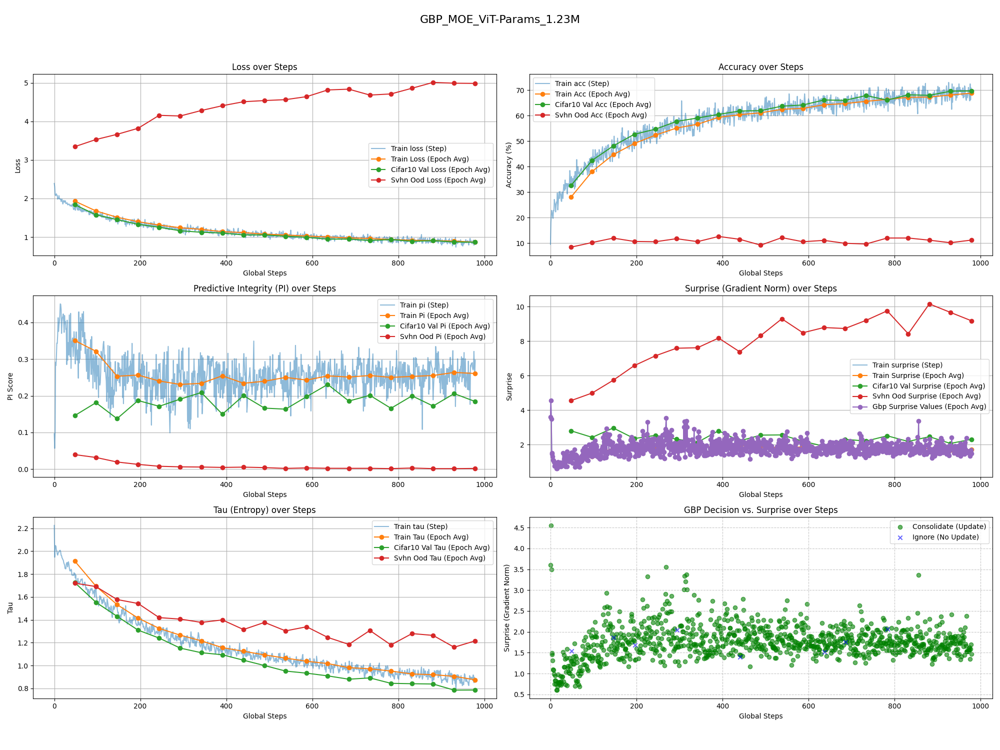
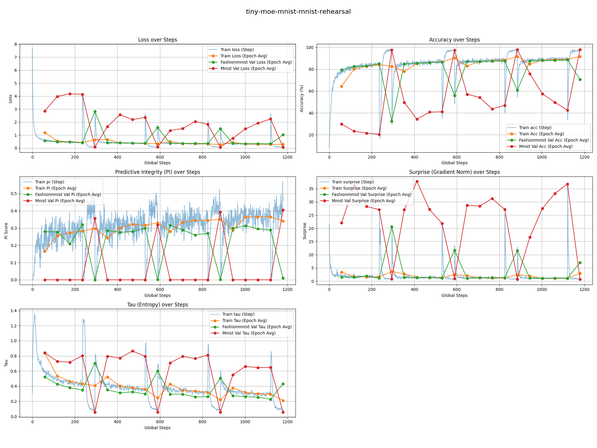
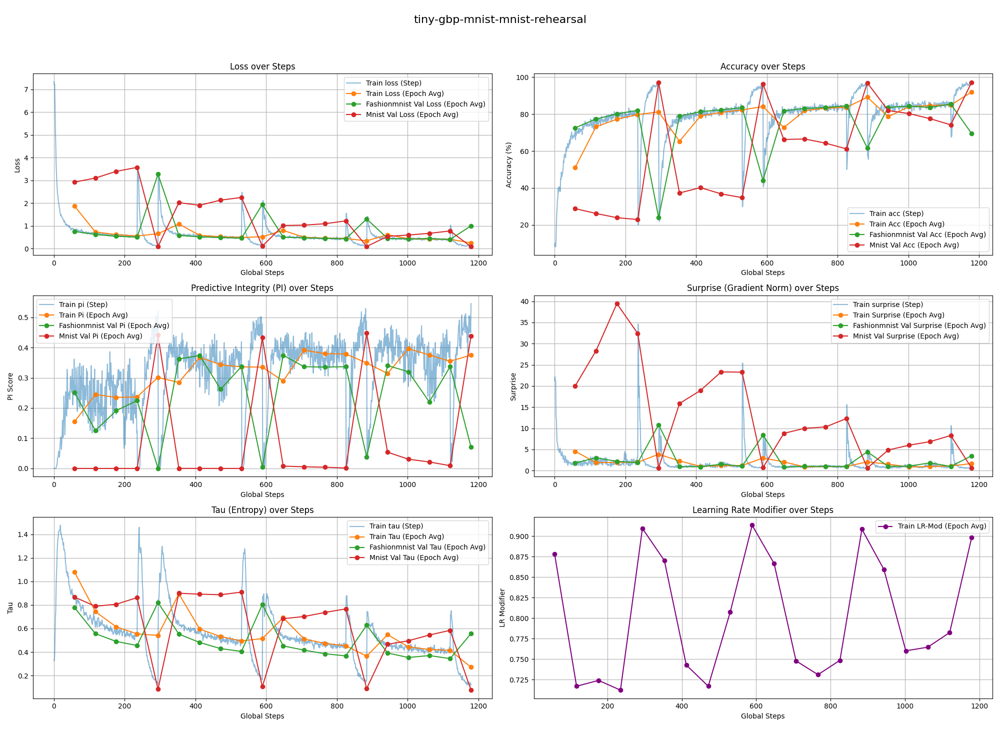

# **Technical Notes: PILF (Predictive Integrity Learning Framework)**

**Document Version:** 3.0

**Core Concept:** A cognitive learning framework designed to transform fixed hyperparameters (like learning rate, model capacity) into dynamic policies driven in real-time by the intrinsic "surprise" (`Surprise`) of data. It is essentially an **adaptive hyperparameter scheduling algorithm** that allows a model to autonomously decide "how much to learn" and "with what capacity to learn" based on the value of the learning content. This framework originates from the Integrated Predictive Workspace Theory, with further details available in the paper at https://github.com/dmf-archive/IPWT.

---

## **1. Design Philosophy: From "Fixed Rules" to "Dynamic Policies"**

Traditional training paradigms rely on manually set hyperparameters that are typically fixed or decay according to a predetermined schedule throughout the training process. This "one-size-fits-all" approach ignores the vast differences in learning value contained in different data batches.

PILF's design philosophy is: **to replace static, human-set rules with dynamic, data-driven policies.**

It no longer blindly uses a fixed learning rate or model capacity. Instead, it dynamically and proportionally adjusts its learning behavior by assessing the `Surprise` from each data batch:

1. **Dynamic Learning Rate**: When `Surprise` is moderate, it signals valuable "learnable zone" information, and the system assigns a higher learning rate. When `Surprise` is too low (redundant information) or too high (anomalous information), it assigns a learning rate close to zero, naturally achieving "ignore" and "reject" effects. **This directly replaces manually set learning rate schedulers.**
2. **Dynamic Capacity**: In a Mixture-of-Experts (MoE) architecture, `Surprise` not only adjusts the learning rate but also determines the number of "experts" `k` to activate. Simple tasks (low `Surprise`) require only a few experts, while complex tasks (high `Surprise`) dynamically engage more experts. **This replaces fixed Top-K routing.**

---

## **2. Core Implementation: From PILR-S to PILF**

### **Stage 1: PILR-S (Predictive Integrity-driven Learning Rate Scheduler)**

PILR-S is the direct application of the PILF idea on **any standard neural network**. It focuses on one question: **How to dynamically adjust the learning rate based on `Surprise`?** This is achieved using the core calculation toolkit from the [SigmaPI](https://github.com/dmf-archive/SigmaPI) project, which is a required dependency. The testing framework and experiments for PILF are detailed in Section 3.

It replaces the traditional "gating" logic of whether to execute `optimizer.step()` with a smooth, continuous learning rate modulator.



**Mechanism Explained:**

1. **`Surprise` Calculation**: Currently, `Surprise` is calculated using the norm of the backpropagation gradients. In the future, it is entirely feasible to use accumulated gradients from the Forward-Forward Algorithm as the source of surprise. This process would not need to wait for expensive backpropagation, allowing for a rapid assessment of learning value.
2. **Dynamic Modulation**: The PILR-S module receives the `Surprise` and calculates a smooth modulation factor `lr_modifier` (ranging from 0 to 1) using a Gaussian function `exp(-0.5 * ((surprise - mu) / sigma)^2)`, based on its relationship with the Exponential Moving Average (EMA) and standard deviation (std) of `Surprise`.
3. **Weight Update**: The standard `loss.backward()` is executed only after `lr_modifier` is calculated. Subsequently, the `optimizer` uses `effective_lr = base_lr * lr_modifier` to perform the weight update. `optimizer.step()` is **always executed**, but its update magnitude has been pre-emptively and dynamically scaled by `Surprise`.

### **Stage 2: PILF (The Complete Form - Dynamic Learning Rate + Dynamic Capacity)**

PILF is the full implementation on an MoE architecture, extending the dynamic scheduling concept to model capacity allocation.



**Training Loop Explained:**

1. **Dual Dynamic Decision**: The model receives data and calculates an initial `Surprise`. Based on this `Surprise`, PILF makes two decisions in parallel:
    - **Capacity Decision**: `k = g(Surprise)`, determining how many experts to activate.
    - **Learning Rate Decision**: `lr_modifier = f(Surprise)`, determining the learning intensity.
2. **Dynamic Routing and Computation**: The gating network routes the task to the most appropriate experts based on the `k` value.
3. **Dynamic Weight Update**: After calculating the loss and gradients, the optimizer uses the effective learning rate modulated by `lr_modifier` to update **only the activated experts and the gating network**.

---

## **3. Model Zoo & Experiments**

Our test suite is now centered around a lightweight (~1M parameter) Vision Transformer architecture to facilitate rapid experimentation on cognitive learning principles. We compare three main variants on CIFAR-10, using SVHN as an Out-of-Distribution (OOD) validation set.

The goal is to observe how different learning strategies perform under resource constraints, providing a clearer view of the benefits of mechanisms like Gated Backpropagation (GBP).

**"Don't just train your model. Understand its mind."**

| **Baseline ViT** | **4x1 MoE-ViT** | **16x4 MoE-ViT** | **16x4 GBP-MoE-ViT with 3σ Learning** |
| :---: | :---: | :---: | :---: |
| ~0.81M | ~1.21M | ~1.23M | ~1.23M |
|  |  |  |  |

### MNIST Rehearsal Experiments

We also conducted rehearsal experiments on MNIST and FashionMNIST datasets to further explore continual learning capabilities.

| **8x2 all time (FashionMNIST -> MNIST)** | **8x2 in pretrain + 8x2 GBP in rehearsal (FashionMNIST -> MNIST)** | **8x2 GBP all time (FashionMNIST -> MNIST)** |
| :---: | :---: | :---: |
|  |  |  |

---

## **4. Installation & Usage**

This project relies on the `sigma-pi` package for core calculations. To replicate the experiments and use the full testing framework, you must first clone this repository.

```bash
git clone https://github.com/dmf-archive/PILF.git
cd PILF
```

**Note:** This package does not automatically install PyTorch. Please manually install the appropriate version for your system (CPU or CUDA) before proceeding. For CUDA-enabled systems, it is recommended to use `uv` or `pip`:
```bash
# Example for CUDA 12.1
uv pip install torch torchvision torchaudio --index-url https://download.pytorch.org/whl/cu121
```

After setting up PyTorch, install the testing framework dependencies:
```bash
pip install -e .[dev]
```

The testing framework is modular and configuration-driven.

### 4.1. Configure Your Experiment

Create or modify a configuration file in `test/configs/`. For example, `test/configs/base_vit.py`:

```python
# test/configs/base_vit.py

# Model parameters
model_config = {
    'model_type': 'base',
    'embed_dim': 128,
    'depth': 6,
    # ... other model params
}

# Training parameters
train_config = {
    'epochs': 20,
    'batch_size': 256,
    # ... other training params
}
```

### 4.2. Run the Experiment

Launch the experiment from the root directory using the `test/run_experiment.py` script:

```bash
python test/run_experiment.py --config test/configs/base_vit.py
```

To run the other variants, simply point to their respective config files:

```bash
# Run MoE-ViT experiment
python test/run_experiment.py --config test/configs/moe_vit.py

# Run GBP-MoE-ViT experiment
python test/run_experiment.py --config test/configs/gbp_moe_vit.py
```

---

## **5. Theoretical Contributions**

- **Transforms Hyperparameters into Policies**: Converts learning rate and model capacity from developer-set "static hyperparameters" into "dynamic policies" that the model adjusts autonomously based on data value.
- **Unifies "Learning" and "Forgetting"**: By linking the learning rate to `Surprise`, PILF provides a unified framework to handle learning, ignoring (low `Surprise` leads to low `lr`), and rejecting (high `Surprise` leads to low `lr`), thereby intrinsically mitigating catastrophic forgetting.
- **On-Demand Resource Allocation**: (PILF) achieves true on-demand computation, where simple tasks consume minimal resources, and complex tasks dynamically call upon more resources, significantly improving efficiency.

---

## **6. Evolution Path**

- **Stage 1: PILR-S (Dynamic Learning Rate)**
  - **Goal:** Replace fixed learning rate schedulers with a `Surprise`-driven dynamic learning rate on any standard model.
  - **Core Mechanism:** `effective_lr = base_lr * f(Surprise)`.
  - **Advantage:** No need to modify the model architecture; can be a drop-in replacement for existing training workflows to quickly validate the effectiveness of the dynamic policy.

- **Stage 2: PILF (Dynamic Learning Rate + Dynamic Capacity)**
  - **Goal:** Implement a fully adaptive cognitive system on an MoE architecture.
  - **Core Mechanism:** `k = g(Surprise)` and `effective_lr = base_lr * f(Surprise)` operate in parallel.
  - **Advantage:** Maximizes computational efficiency and model capacity scalability.

---

This project is licensed under the AGPLv3. See the `LICENSE` file for details.
