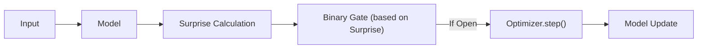
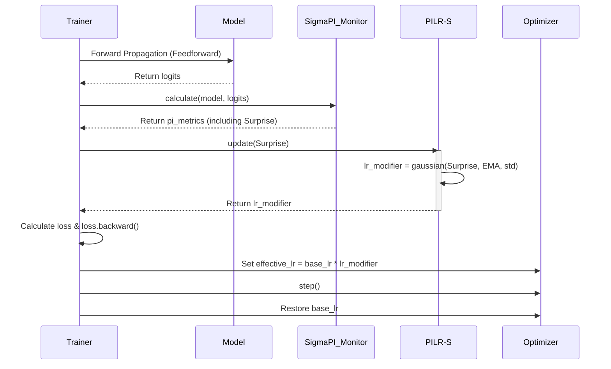
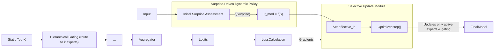
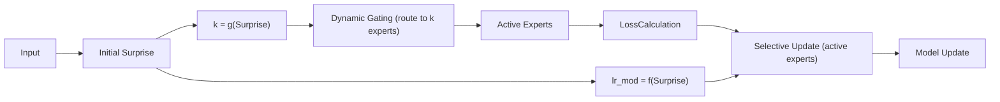

# Predictive Integrity Learning Framework (PILF)

> "Don't just train your model, understand its mind."

<p align="center">
  <a href="./readme.md">English</a> | <a href="readme_ZH.md">中文</a> | <a href="zoo.md">Model Zoo (EN)</a> | <a href="zoo_zh.md">模型动物园 (ZH)</a>
</p>

---

Core Concept: A cognitive learning framework designed to transform fixed hyperparameters (e.g., learning rate, model capacity) into dynamic strategies driven by the intrinsic "Surprise" of data. It is essentially an adaptive hyperparameter scheduling algorithm that allows the model to autonomously decide "how much to learn" and "how much capacity to use" based on the value of the learning content. This framework originates from the IPWT (Integrated Predictive Workspace Theory), with related paper information available at <https://github.com/dmf-archive/IPWT>

## 1. Design Philosophy: From "Fixed Rules" to "Dynamic Strategies"

Traditional training paradigms rely on manually set hyperparameters that are typically fixed or decay according to a predetermined schedule throughout the training process (e.g., learning rate). This "one-size-fits-all" approach ignores the vast differences in learning value contained within different data batches.

PILF's design philosophy is: **to replace static, human-set rules with dynamic, data-driven strategies.**

It no longer blindly uses a fixed learning rate or fixed model capacity, but instead dynamically and proportionally adjusts its learning behavior by real-time evaluating the `Surprise` brought by each batch of data:

1. **Dynamic Learning Rate**: When `Surprise` is moderate, it means valuable "learnable" information has been encountered, and the system will allocate a higher learning rate; when `Surprise` is too low (redundant information) or too high (anomalous information), a learning rate close to zero will be allocated, thereby naturally achieving the effects of "ignoring" and "rejecting." **This directly replaces manually set learning rate schedulers.**
2. **Dynamic Capacity**: In the MoE architecture, `Surprise` not only regulates the learning rate but also determines the number of "experts" `k` that need to be activated. Simple tasks (low `Surprise`) require only a few experts, while complex tasks (high `Surprise`) will dynamically mobilize more experts to participate. **This replaces fixed Top-K routing.**

## 2. Core Implementation: Evolution Stages of PILF

The evolution of PILF is divided into five main stages, each building upon the previous one, gradually achieving more advanced adaptive capabilities:

### Stage Zero: MoE-GBP (Gated Backpropagation)

In traditional training, selective weight updates are performed through a gating mechanism to mitigate catastrophic forgetting. The execution of `optimizer.step()` is controlled by a binary gating signal based on the `Surprise` metric. As a precursor to PILF, it validated the effectiveness of selective learning based on PI, laying the foundation for subsequent dynamic learning rate and capacity scheduling.



### Stage One: PILR-S (Predictive Integrity Learning Rate Scheduler)

PILR-S is the direct application of the PILF idea to **any standard neural network**. It focuses on one question: **How to dynamically adjust the learning rate based on `Surprise`?** This is achieved through the core computational toolkit [SigmaPI](https://github.com/dmf-archive/SigmaPI), which is a necessary dependency for this project. Details of the PILF testing framework and experiments can be found in Section 3.

It replaces the traditional "gating" logic of whether `optimizer.step()` is executed, evolving into a smooth, continuous learning rate modulator.



**Mechanism Details:**

1. **`Surprise` Calculation**: Currently, we use the backpropagation gradient norm for calculation, but in the future, Forward Forward accumulated gradients could be considered as a source of surprise. This process does not require waiting for expensive backpropagation, enabling rapid assessment of learning value.
2. **Dynamic Modulation**: The PILR-S module receives `Surprise` and calculates a smooth modulation factor `lr_modifier` (ranging from 0 to 1) using a Gaussian function `exp(-0.5 * ((surprise - mu) / sigma)^2)` based on its relationship with the Exponential Moving Average (EMA) and standard deviation (std) of `Surprise`.
3. **Weight Update**: After `lr_modifier` is calculated, standard `loss.backward()` is executed. Subsequently, the `optimizer` uses `effective_lr = base_lr * lr_modifier` to perform weight updates. `optimizer.step()` **is always executed**, but its update magnitude has been dynamically scaled by `Surprise` beforehand.

### Stage Two: PIL-MoE (Predictive Integrity-driven Learning Mixture of Experts - Static Top-K) (Current Stage)

**Goal:** Introduce PILR-S's dynamic learning rate mechanism into the MoE architecture, combined with static Top-K hard routing, while only updating the weights of activated experts.

**Core Mechanism:** `effective_lr = base_lr * f(Surprise)` is applied to the MoE architecture. The gating network routes tasks to experts based on a static Top-K value, and only the weights of activated experts are updated.

**Advantages:** Introduces data-driven learning rates in the MoE architecture, while improving training efficiency through selective updates and laying the foundation for subsequent dynamic capacity allocation.



### Stage Three: PILD-MoE (Predictive Integrity-driven Dynamic Mixture of Experts)

**Goal:** Achieve a fully adaptive cognitive system where `Surprise` not only regulates the learning rate but also dynamically scales the number of activated experts `k`.

**Core Mechanism:** `k = g(Surprise)` and `effective_lr = base_lr * f(Surprise)` operate in parallel. The model dynamically adjusts the number of activated experts and learning intensity based on data complexity.

**Advantages:** Maximizes computational efficiency and model capacity scalability, truly achieving on-demand allocation of computational resources.



### Stage Four: G²PIL (Generative Gaussian Predictive Integrity Learning)

**Goal:** Build a fully self-organizing, self-consolidating, and self-evolving cognitive architecture to achieve the ultimate leap from "passive learning" to "active creation."

**Core Mechanism:**

1. **Gaussian Field Cognitive Space:**

    - Completely abandons discrete, decision-based gating networks.
    - The entire system is a high-dimensional, continuous "cognitive space."
    - **Expert as Embedding:** Each expert is no longer a called function but a **Gaussian probability distribution** in this space, representing its "knowledge domain" or "area of expertise."
    - **Input as Probe:** Any input data is mapped as a "probe" (a point or a narrower Gaussian distribution) in this space.
    - **Activation as Resonance:** The routing process is replaced by "Anycast"-style probabilistic matching. Experts are "soft-activated" based on the overlap between the input probe and their knowledge distribution, with activation strength being continuous and probabilistic.

2. **Generative Memory Consolidation:**
    - Introduces a parallel **Generative Model** as the system's "subconscious" or "dream engine."
    - **Learning the World While Awake:** The generator learns the underlying distribution of real data when the system interacts with the external world.
    - **Creating the World While Asleep:** In the absence of external input, the generator begins to "dream," i.e., **generate synthetic data**. These dream data contain abstractions and mixtures of all past experiences.
    - **Self-Replay and Consolidation:** The system feeds these internally generated "dreams" back to itself as rehearsal material. By "rehearsing" in dreams, experts maintain the stability of their knowledge distribution and resist forgetting.

#### G²PIL = Gaussian × Generative

- **Gaussian** solves the problem of **Space**: It defines **how knowledge is organized and accessed**. It creates a geometry of thought, giving concepts position, relationships, and distance, making routing smooth, probabilistic, and robust.
- **Generative** solves the problem of **Time**: It defines **how knowledge is maintained and evolved**. It frees the system from reliance on external data storage, enabling internal memory consolidation and creative self-replay.

## 3. Installation and Usage

This project relies on the `sigma-pi` package for core computations. To reproduce experiments and use the full testing framework, you must first clone this repository.

```bash
git clone https://github.com/dmf-archive/PILF.git
cd PILF
```

**Note:** This package does not automatically install PyTorch. Please manually install the appropriate version for your system (CPU or CUDA) before proceeding. For CUDA-enabled systems, it is recommended to install using `uv` or `pip`:

```bash
# CUDA 12.1 Example
uv pip install torch torchvision torchaudio --index-url https://download.pytorch.org/whl/cu121
```

After setting up PyTorch, install the testing framework dependencies:

```bash
pip install -e .[dev]
```

The testing framework is modular and configuration-driven.

### 3.1. Configure Your Experiment

Create or modify a configuration file in the `configs/` directory. For example, `configs/base_vit.py`:

```python
# test/configs/base_vit.py

# Model Parameters
model_config = {
    'model_type': 'base',
    'embed_dim': 128,
    'depth': 6,
    # ... Other model parameters
}

# Training Parameters
train_config = {
    'epochs': 20,
    'batch_size': 256,
    # ... Other training parameters
}
```

### 3.2. Run Experiments

Launch experiments from the root directory using the `run_experiment.py` script:

```bash
python run_experiment.py --config configs/base_vit.py
```

To run other variants, simply point to their respective configuration files:

```bash
# Run MoE-ViT experiment
python run_experiment.py --config configs/moe_vit.py

# Run PILR-S-MoE-ViT experiment
python run_experiment.py --config configs/gbp_moe_vit.py
```

## 4. Theoretical Contributions

- **Transforming Hyperparameters into Strategies**: Transforms learning rates and model capacities from "static hyperparameters" set by developers into "dynamic strategies" autonomously adjusted by the model based on data value.
- **Unifying "Learning" and "Forgetting"**: By linking the learning rate to `Surprise`, PILF provides a unified framework to handle learning, ignoring (low `Surprise` leads to low `lr`), and rejecting (high `Surprise` leads to low `lr`), thereby intrinsically mitigating catastrophic forgetting.
- **On-Demand Allocation of Computational Resources**: (PILF) achieves true on-demand computation, where simple tasks consume minimal resources, while complex tasks dynamically call upon more resources, greatly improving efficiency.

---

This project is licensed under the AGPLv3 License. See the `LICENSE` file for details.
