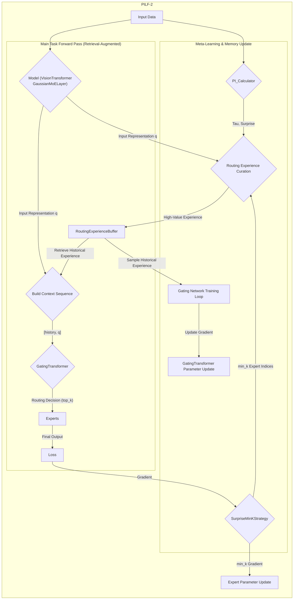

# Predictive Integrity Learning Framework (PILF)

[](https://github.com/dmf-archive/IPWT)
[](https://www.gnu.org/licenses/agpl-3.0)
[](https://deepwiki.com/dmf-archive/PILF)

> "Don't just train your model, understand its mind."

<p align="center">
    <a href="zoo.md">[Model Zoo]</a> | <a href="readme_zh.md">[中文]</a>
</p>

---

**PILF** is a cognitive learning framework designed to enhance the continuous learning capabilities of Mixture-of-Experts (MoE) models through a dedicated meta-learning gating mechanism. It achieves stable policy optimization by decoupling the learning of routing strategies from the acquisition of new knowledge.

The technical and theoretical foundation of this framework is **[IPWT (Integrated Predictive Workspace Theory)](https://github.com/dmf-archive/IPWT)**.

## Design Philosophy: From "Fixed Rules" to "Dynamic Strategies"

Traditional training paradigms rely on manually set hyperparameters that are typically fixed or decay according to a predetermined schedule throughout the training process (e.g., learning rate). This "one-size-fits-all" approach ignores the vast differences in learning value contained within different data batches.

PILF's design philosophy is: **to replace static, human-set rules with dynamic, data-driven strategies.**

It no longer blindly uses a fixed learning rate or fixed model capacity, but instead dynamically and proportionally adjusts its learning behavior by real-time evaluating the `Surprise` brought by each batch of data.

## PILF-2 Architecture Overview

PILF-2 enhances continuous learning in MoE models via a meta-learning gating mechanism, decoupling routing strategy learning from knowledge acquisition for stable policy optimization.

### Core Components

- **Base Model**: `VisionTransformer` for feature extraction.
- **Expert Layer**: `GaussianMoELayer` with N independent experts, each defined by a learnable Gaussian distribution (`μ`, `log_sigma`) for specialized knowledge domains.
- **Meta-Learning Gating**: `GatingTransformer`, a Transformer-based network, learns to map input representations (Query) to optimal expert routing (Key).
- **Dynamic Regulation & Memory**:
  - `PI_Calculator`: Real-time metrics (Epsilon, Tau, Surprise/Gradient Norm).
  - `SurpriseMinKStrategy` (SMK): Updates only `min_k` experts with lowest `Surprise` during backpropagation.
  - `RoutingExperienceBuffer`: Stores high-uncertainty/surprise routing events for replay.

### System Architecture Sequence



### Training Process Summary

PILF-2 training involves three phases:

1. **Main Task Optimization & Experience Collection**: Input data is processed by `VisionTransformer` to generate an input representation `q`. This `q` is used to retrieve relevant historical experiences from the `RoutingExperienceBuffer`. Both are then fed into the `GatingTransformer` to activate `top_k` experts. `expert_loss` is calculated, and `Surprise` is used by `SMK` to select `min_k` experts for updates. High-value routing events (based on `Tau` and `Surprise`) are stored in `RoutingExperienceBuffer`.
2. **Gating Network Policy Optimization**: Periodically, `GatingTransformer` is trained on sampled historical experiences from `RoutingExperienceBuffer` to learn successful routing decisions, using a supervised learning approach.
3. **Parameter Updates Application**: Gradients from both main task optimization (SMK-filtered) and gating network optimization are applied to update respective model parameters.

## Future Features

### Dynamic Top-K

This mechanism will dynamically adjust the number of activated experts, `k`, based on `Surprise` (`k = g(Surprise)`). Simple tasks will require fewer experts, while complex tasks will dynamically mobilize more.

Recent academic research has already provided excellent, well-validated solutions to this problem. Therefore, we have decided to pause our internal experiments in this specific direction and recommend that all researchers interested in dynamic expert routing refer to the following work:

- **Paper:** [Dynamic Mixture of Experts: An Auto-Tuning Approach for Efficient Transformer Models (Guo et al., 2024)](https://arxiv.org/abs/2405.14297)
- **Code:** [https://github.com/LINs-lab/DynMoE](https://github.com/LINs-lab/DynMoE)

The `DynMoE` framework provides a powerful mechanism for automatically adjusting the number of activated experts, which aligns well with PILF's philosophy of dynamic strategies. Our future work will consider integrating update strategies like `SMK` on top of mature dynamic routing mechanisms similar to `DynMoE`.

### Dynamic Schedules

This mechanism allows the model to autonomously manage its learning schedule based on PI scores, aiming to maximize PI for all tasks. The model will review historical ΔACC (accuracy change) and ΔPI (predictive integrity change) from past learning cycles to select the most efficient learning path, ensuring that after a task is Grokked, it can autonomously switch to reviewing other tasks.

## Installation and Usage

To reproduce experiments and use the full framework, you must first clone this repository.

```bash
git clone https://github.com/dmf-archive/PILF.git
cd PILF
```

**Note:** This package does not automatically install PyTorch. Please manually install the appropriate version for your system (CPU or CUDA) before proceeding. For CUDA-enabled systems, it is recommended to install using `uv` or `pip`:

```bash
# CUDA 12.1 Example
uv pip install torch torchvision torchaudio --index-url https://download.pytorch.org/whl/cu121
```

After setting up PyTorch, install the framework's dependencies:

```bash
uv pip install -e .[dev]
```

All experiments are launched from the root directory using the `main.py` script, which dynamically combines models and training strategies via command-line arguments.

| Script    | Main Purpose                | Example Command                                                                                                                 |
| :-------- | :-------------------------- | :------------------------------------------------------------------------------------------------------------------------------ |
| `main.py` | Run all types of experiments| `python main.py --schedule <schedule_path> --router <router_type> --update <update_strategy>`                |
| `main.py` | Resume training from checkpoint | `python main.py --schedule <schedule_path> --router <router_type> --update <update_strategy> --resume-from <ckpt>` |
| `main.py` | Run a specific combination  | `python main.py --schedule marathon_v3 --router memory_gaussian --update smk`      |

---

## Citation

If you use this project in your research, please cite it as follows:

```bibtex
@misc{pilf,
  author       = {Rui, L.},
  title        = {{PILF: Predictive Integrity Learning Framework}},
  year         = {2025},
  publisher    = {GitHub},
  url          = {https://github.com/dmf-archive/PILF}
}
```

## License

This project is licensed under the AGPLv3 License. See the `LICENSE` file for details.
