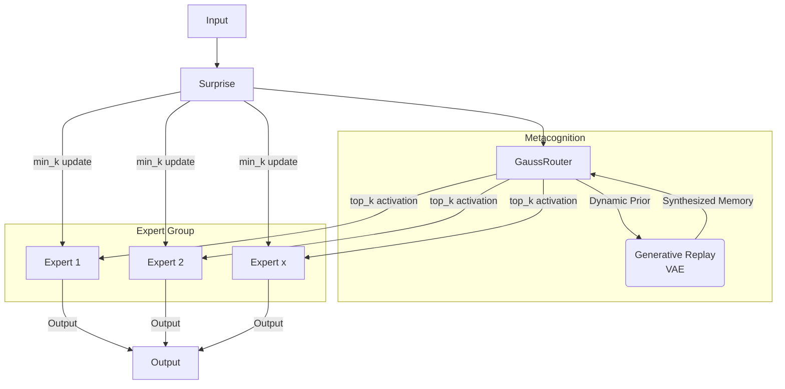

# Predictive Integrity Learning Framework (PILF)

[](https://github.com/dmf-archive/IPWT)
[](https://www.gnu.org/licenses/agpl-3.0)
[](https://deepwiki.com/dmf-archive/PILF)

> "Don't just train your model, understand its mind."

<p align="center">
    <a href="zoo.md">[Model Zoo]</a> | <a href="readme_zh.md">[中文]</a>
</p>

---

**PILF** is a cognitive learning framework designed to transform fixed hyperparameters (e.g., learning rate, model capacity) into dynamic strategies driven by the intrinsic "Surprise" of data.

It allows the model to:

- **Perceive Value**: Evaluate the learning value of each data batch in real-time.
- **Decide Autonomously**: Based on this value, decide "how much to learn" (learning rate) and "with how much capacity" (model capacity).

The technical and theoretical foundation of this framework is **[IPWT (Integrated Predictive Workspace Theory)](https://github.com/dmf-archive/IPWT)**.

## Design Philosophy: From "Fixed Rules" to "Dynamic Strategies"

Traditional training paradigms rely on manually set hyperparameters that are typically fixed or decay according to a predetermined schedule throughout the training process (e.g., learning rate). This "one-size-fits-all" approach ignores the vast differences in learning value contained within different data batches.

PILF's design philosophy is: **to replace static, human-set rules with dynamic, data-driven strategies.**

It no longer blindly uses a fixed learning rate or fixed model capacity, but instead dynamically and proportionally adjusts its learning behavior by real-time evaluating the `Surprise` brought by each batch of data.

## Framework



### Surprise-Min-K (SMK)

SMK is an adaptive scheme that promotes expert specialization and model interpretability. Originating from Gated Backpropagation (GBP), a hard-gating update mechanism based on `Surprise`, SMK refines this idea. After the `top-k` experts are activated, the system calculates the `Surprise` for each expert and retains only the `min_k` experts with the lowest `Surprise` for updating. This is a digital reproduction of Neural Darwinism, accelerating functional convergence and forcing the model to rely on its most "confident" experts. This allows for easy observation of expert activation patterns across different tasks.

### GaussMoE (Gaussian-Routed MoE)

To address the fundamental flaws of linear gating, we introduced **Gaussian Routing**, which is the core of our current research. It promotes expert specialization and, when paired with SMK, shows excellent resistance to catastrophic forgetting. However, it cannot overcome catastrophic forgetting on its own in a context-free environment.

1. **Experts as Distributions**: Each expert is no longer a simple MLP but is defined by a learnable Gaussian distribution (parameterized by a mean `μ` and a log standard deviation `log_sigma`) in the input space, representing its "domain of knowledge."
2. **Routing as Probability Calculation**: The routing process is no longer a simple linear mapping but involves calculating the log probability density of the input `x` under each expert's Gaussian distribution. This probability reflects how well the input matches an expert's "knowledge domain," which fundamentally promotes the **functional specialization** and **interpretability** of experts.

### PILR-S/D (Predictive Integrity-driven Learning Rate Scheduler)

This is a dynamic learning rate control mechanism. Unfortunately, it often introduces more hyperparameters, and its effectiveness is still under investigation. Compared to the significant results of SMK, PILR's contribution is less remarkable at this stage.

## Future Features

### GenGaussMoE (Generative Gaussian-Routed MoE)

The goal of this stage is to achieve a fully adaptive cognitive system by introducing a parallel generative model to produce synthetic data for "dream rehearsal," actively combating catastrophic forgetting and enabling self-consolidation of knowledge.

### Dynamic Top-K

This mechanism will dynamically scale the number of activated experts, `k`, based on `Surprise` (`k = g(Surprise)`). Simple tasks will require fewer experts, while complex tasks will dynamically mobilize more. This is not yet implemented due to the current small scale of experiments and its relative simplicity to implement later.

### Dynamic Schedules

This mechanism allows the model to autonomously manage its learning schedule based on PI scores, aiming to maximize PI for all tasks. The model will review historical ΔACC (accuracy change) and ΔPI (predictive integrity change) from past learning cycles to select the most efficient learning path, ensuring that after a task is Grokked, it can autonomously switch to reviewing other tasks.

## Installation and Usage

To reproduce experiments and use the full framework, you must first clone this repository.

```bash
git clone https://github.com/dmf-archive/PILF.git
cd PILF
```

**Note:** This package does not automatically install PyTorch. Please manually install the appropriate version for your system (CPU or CUDA) before proceeding. For CUDA-enabled systems, it is recommended to install using `uv` or `pip`:

```bash
# CUDA 12.1 Example
uv pip install torch torchvision torchaudio --index-url https://download.pytorch.org/whl/cu121
```

After setting up PyTorch, install the framework's dependencies:

```bash
uv pip install -e .[dev]
```

All experiments are launched from the root directory using the `train.py` script, which is driven by a **schedule file** and a **model configuration file**.

| Script| Main Purpose| Example Command  |
| :--- | :---- | :--- |
| `train.py` | Run all types of experiments| `python train.py --schedule <schedule_path> --model-config <model_config_path>`  |

---

## Citation

If you use this project in your research, please cite it as follows:

```bibtex
@misc{pilf,
  author       = {Rui, L.},
  title        = {{PILF: Predictive Integrity Learning Framework}},
  year         = {2025},
  publisher    = {GitHub},
  url          = {https://github.com/dmf-archive/PILF}
}
```

## License

This project is licensed under the AGPLv3 License. See the `LICENSE` file for details.
