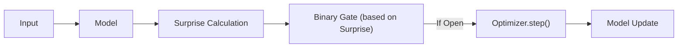
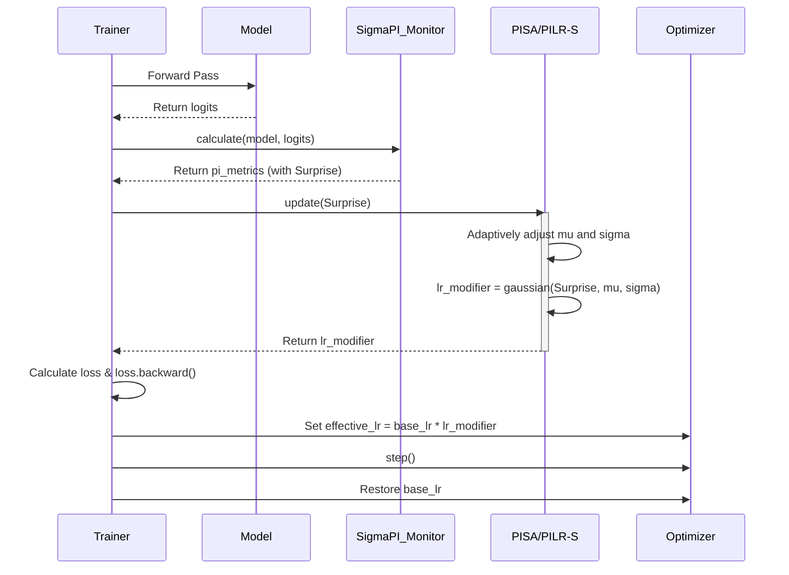
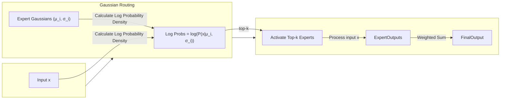
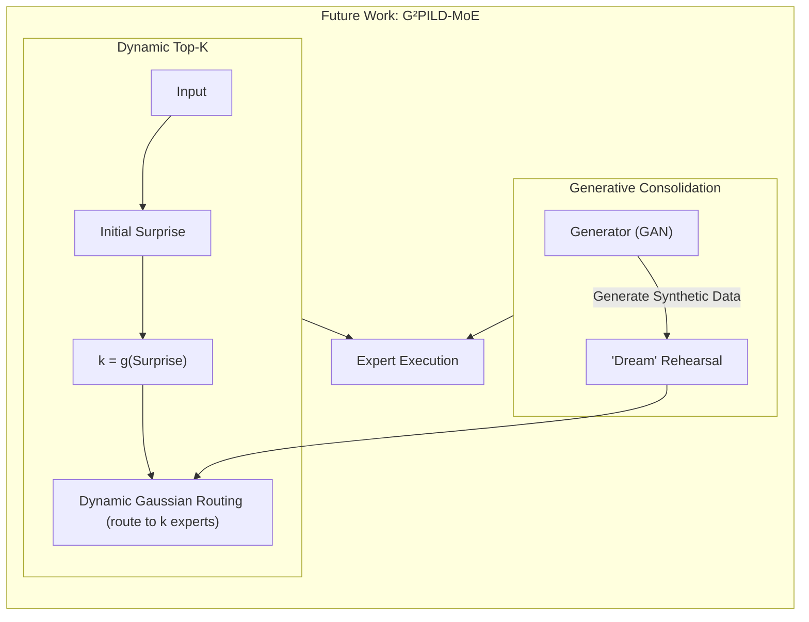

# Predictive Integrity Learning Framework (PILF)

[](https://www.gnu.org/licenses/agpl-3.0)
[](https://deepwiki.com/dmf-archive/PILF)

> "Don't just train your model, understand its mind."

<p align="center">
    <a href="docs/zoo.md">[Model Zoo]</a> | <a href="readme_zh.md">[中文]</a>
</p>

---

**PILF** is a cognitive learning framework designed to transform fixed hyperparameters (e.g., learning rate, model capacity) into dynamic strategies driven by the intrinsic "Surprise" of data.

It is essentially an adaptive hyperparameter scheduling algorithm that allows the model to:

- **Perceive Value**: Evaluate the learning value of each data batch in real-time.
- **Decide Autonomously**: Based on this value, decide "how much to learn" (learning rate) and "with how much capacity" (model capacity).

The technical and theoretical foundation of this framework is **[IPWT (Integrated Predictive Workspace Theory)](https://github.com/dmf-archive/IPWT)**.

## 1. Design Philosophy: From "Fixed Rules" to "Dynamic Strategies"

Traditional training paradigms rely on manually set hyperparameters that are typically fixed or decay according to a predetermined schedule throughout the training process (e.g., learning rate). This "one-size-fits-all" approach ignores the vast differences in learning value contained within different data batches.

PILF's design philosophy is: **to replace static, human-set rules with dynamic, data-driven strategies.**

It no longer blindly uses a fixed learning rate or fixed model capacity, but instead dynamically and proportionally adjusts its learning behavior by real-time evaluating the `Surprise` brought by each batch of data.

## 2. Core Implementation: The Evolution Roadmap of PILF

The evolution of PILF is divided into several stages, each building upon the previous one to achieve progressively more advanced adaptive capabilities.

### Stage 0: MoE-GBP (Gated Backpropagation) - [Deprecated]

As the conceptual predecessor to PILF, GBP (Gated Backpropagation) first validated the effectiveness of selective learning based on the `Surprise` metric. It used a simple binary gate signal to decide whether to execute `optimizer.step()`, thereby applying a "hard" suppression to high-`Surprise` updates that could be detrimental.

- **Problems Encountered**: This "all-or-nothing" gating was too coarse to allow for smooth, proportional regulation of cognitive resources.
- **Evolutionary Path**: Its core idea of selective updating has been inherited and enhanced by the more refined `Surprise-Min-K` mechanism.



### Stage 1: PILR-S (Predictive Integrity-driven Learning Rate Scheduler)

This is the direct application of the PILF concept to **any standard neural network**. It focuses on a single question: **How to dynamically adjust the learning rate based on `Surprise`?**

- **Core Mechanism**: `effective_lr = base_lr * f(Surprise)`. It replaces traditional learning rate schedulers by using a Gaussian function, `exp(-0.5 * ((surprise - mu) / sigma)^2)`, to calculate a smooth modulation factor, `lr_modifier`, which dynamically scales the learning rate.
- **PISA (Predictive Integrity-driven Sigma Adaptor)**: The key enhancement to PILR-S. It transforms the standard deviation, `sigma`, in the Gaussian function from a fixed hyperparameter into a dynamic, adaptive state variable. The value of `sigma` is dynamically determined by the second-order statistics (exponential moving variance) of `Surprise`, enabling the model to adapt its learning "tolerance" or "openness" based on the "chaotic level" of its environment.
- **Configuration Flexibility**: In the current implementation, setting `beta=0` in the configuration file fixes `sigma`, causing PISA to revert to an equivalent PILR-S mode. This is crucial for maximizing learning efficiency on specific tasks.



### Stage 2: PIL-MoE (Linear-Gated MoE) - [Deprecated]

This stage attempted to apply PILR-S to a standard Mixture-of-Experts (MoE) architecture that used a simple linear layer as its gating network.

- **Problems Encountered**:
  1. **Lack of Significant Functional Specialization**: The linear gate was too simple to guide the experts toward developing stable and distinct functional specializations.
  2. **Catastrophic Forgetting in the Gating Network**: The gating network, being a small neural network itself, also suffered from catastrophic forgetting. After learning a new task, it would forget how to route data from old tasks to the correct experts, leading to a collapse in the entire model's performance.

### Stage 3: GPIL-MoE (Gaussian-Routed MoE) - [Current Stage]

To address the fundamental flaws of linear gating, we introduced **Gaussian Routing**, which is the core of our current research.

**Core Mechanism: Experts as Distributions, Routing as Probability**

1. **Experts as Distributions**: Each expert is no longer a simple MLP but is defined by a learnable Gaussian distribution (parameterized by a mean `μ` and a log standard deviation `log_sigma`) in the input space, representing its "domain of knowledge."
2. **Routing as Probability Calculation**: The routing process is no longer a simple linear mapping but involves calculating the log probability density of the input `x` under each expert's Gaussian distribution. This probability reflects how well the input matches an expert's "knowledge domain," which fundamentally promotes the **functional specialization** and **interpretability** of experts.
3. **Sparse Update**: During backpropagation, only the weights of the `top-k` experts to which the input was routed are updated (including their MLP layers and Gaussian distribution parameters `μ` and `log_sigma`).



**Current Achievements and Advantages:**

1. **Significant Functional Specialization**: Gaussian routing has successfully induced spontaneous functional specialization among the expert networks. Experiments (see the `marathon-v3` series) clearly show that in multi-task learning, different experts develop stable "knowledge domains" for specific datasets (e.g., MNIST vs. CIFAR10).
2. **1-Step Rehearsal**: GPIL-MoE demonstrates excellent resistance to catastrophic forgetting. Thanks to functional specialization, when the model re-encounters an old task, it can quickly reactivate the relevant experts' knowledge with a minimal amount of "rehearsal" (e.g., a single epoch). This marks a significant step toward true continual learning.
3. **Neural Darwinism Pruning (Surprise-Min-K)**: This is a further enhancement to Gaussian routing, inheriting and surpassing the ideas of early GBP. After the `top-k` experts are activated, the system calculates the `Surprise` for each expert and retains only the `min_k` experts with the lowest `Surprise` for updating. This accelerates functional convergence and forces the model to rely on its most "confident" experts, achieving finer-grained resource allocation and stronger knowledge consolidation.

**Limitation: Catastrophic Forgetting Not Yet Eradicated**

Although Gaussian routing significantly **mitigates** catastrophic forgetting through functional specialization, it does **not completely solve** the problem. The experts' "knowledge domains" (i.e., their Gaussian parameters `μ` and `σ`) are still trainable and can "drift" when interfered with by new data distributions. This is why in the future G²PILD-MoE stage, we must introduce a parallel **generative memory system** (e.g., a GAN) to actively consolidate and calibrate these knowledge domains through "dream rehearsal," thereby achieving true continual learning.

### Stage 4: G²PILD-MoE (Generative Gaussian-Routed Dynamic MoE) - [Future Direction]

The goal of this stage is to achieve a fully adaptive cognitive system.

- **Core Mechanism 1: Dynamic Top-K**: `k = g(Surprise)`. `Surprise` will not only regulate the learning rate but also dynamically scale the number of activated experts, `k`. Simple tasks will require fewer experts, while complex tasks will dynamically mobilize more, achieving on-demand allocation of computational resources.
- **Core Mechanism 2: Generative Memory Consolidation**: Introduce a parallel generative model (e.g., GAN) to produce synthetic data for "dream rehearsal," actively combating catastrophic forgetting and enabling self-consolidation of knowledge to build the final G²PIL architecture.



## 3. Installation and Usage

This project relies on the `sigma-pi` package for core computations. To reproduce experiments and use the full framework, you must first clone this repository.

```bash
git clone https://github.com/dmf-archive/PILF.git
cd PILF
```

**Note:** This package does not automatically install PyTorch. Please manually install the appropriate version for your system (CPU or CUDA) before proceeding. For CUDA-enabled systems, it is recommended to install using `uv` or `pip`:

```bash
# CUDA 12.1 Example
uv pip install torch torchvision torchaudio --index-url https://download.pytorch.org/whl/cu121
```

After setting up PyTorch, install the framework's dependencies:

```bash
uv pip install -e .[dev]
```

### 3.1. Running Experiments

All experiments are launched from the root directory using the `train.py` script, which is driven by a **schedule file** and a **model configuration file**.

| Script     | Main Purpose                        | Example Command                                                                                  |
| :--------- | :---------------------------------- | :----------------------------------------------------------------------------------------------- |
| `train.py` | Run all types of experiments        | `python train.py --schedule <schedule_path> --model-config <model_config_path>`                  |
| `train.py` | Run a marathon rehearsal experiment | `python train.py --schedule schedules/marathon_v3.py --model-config configs/large_gpil_mnist.py` |

---

## 4. Citation

If you use this project in your research, please cite it as follows:

```bibtex
@misc{pilf,
  author       = {Rui, L.},
  title        = {{PILF: Predictive Integrity Learning Framework}},
  year         = {2025},
  publisher    = {GitHub},
  url          = {https://github.com/dmf-archive/PILF}
}
```

## 5. License

This project is licensed under the AGPLv3 License. See the `LICENSE` file for details.
