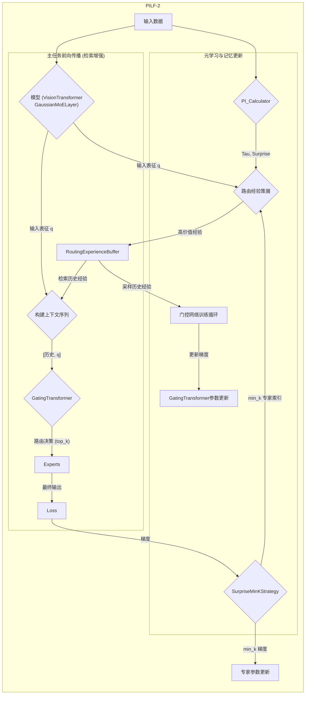

# 预测完整性学习框架（Predictive Integrity Learning Framework, PILF）

[](https://github.com/dmf-archive/IPWT)
[](https://www.gnu.org/licenses/agpl-3.0)
[](https://deepwiki.com/dmf-archive/PILF)

> 不仅要训练你的模型，更要理解它的心智。

> ⚠️ 警告: 本项目已废弃。我们已在此验证SMK的功能分化，关于永续训练的更多尝试将在 [Tiny-ONN](https://github.com/dmf-archive/Tiny-ONN) 中继续。

<p align="center">
    <a href="zoo_zh.md">[模型动物园]</a> | <a href="./readme.md">[English]</a>
</p>

---

**PILF** 是一个认知学习框架，旨在通过专用的元学习门控机制，增强混合专家（MoE）模型的持续学习能力。它通过解耦路由策略的学习与新知识的采集，实现稳定的策略优化。

该框架的技术和理论基础源于 **[IPWT (整合预测工作空间理论)](https://github.com/dmf-archive/IPWT)**。

## 设计哲学：从“固定规则”到“动态策略”

传统训练范式依赖于手动设定的、在整个训练过程中通常固定或按预定计划衰减的超参数（如学习率）。这种“一刀切”的方法忽略了不同数据批次所包含的学习价值的巨大差异。

PILF 的设计哲学是：**用动态的、数据驱动的策略取代静态的、人为设定的规则**。

它不再盲目地使用固定的学习率或固定的模型容量，而是通过实时评估每一批次数据带来的 `Surprise`，动态地、按比例地调整其学习行为。

## PILF-2 架构概览

PILF-2 通过元学习门控机制增强 MoE 模型的持续学习能力，通过解耦路由策略的学习与知识获取，实现稳定的策略优化。

### 核心组件

- **基础模型**: `VisionTransformer` 用于特征提取。
- **专家层**: `GaussianMoELayer` 包含 N 个独立的专家网络，每个专家通过可学习的高斯分布（均值 `μ` 和对数标准差 `log_sigma`）定义其在输入表征空间中的专业领域。
- **元学习门控**: `GatingTransformer` 是一个独立的、基于 Transformer 的网络，负责学习从输入表征（Query）到最优专家路由（Key）的映射策略。
- **动态调节与记忆组件**:
  - `PI_Calculator`: 用于实时计算内在状态指标（预测误差 Epsilon、模型不确定性 Tau 和模型参数更新的惊奇度 Surprise/梯度范数）。
  - `SurpriseMinKStrategy` (SMK): 一种更新策略，在反向传播过程中，仅允许 `Surprise` 最低的 `min_k` 个专家更新其参数。
  - `RoutingExperienceBuffer`: 一个有限容量的经验缓存区，用于存储高不确定性或高惊奇度的路由事件，每个条目包含输入表征、成功的专家路由目标和事件优先级。

### 系统架构序列图



### 训练流程概述

PILF-2 训练包括三个阶段：

1. **主任务优化与经验采集**: 输入数据通过 `VisionTransformer` 生成输入表征 `q`。此 `q` 用于从 `RoutingExperienceBuffer` 中检索相关的历史经验。然后将两者都提供给 `GatingTransformer` 以激活 `top_k` 专家。计算 `expert_loss`，`Surprise` 用于 `SMK` 选择 `min_k` 专家进行更新。高价值路由事件（基于 `Tau` 和 `Surprise`）存储在 `RoutingExperienceBuffer` 中。
2. **门控网络策略优化**: `GatingTransformer` 定期从 `RoutingExperienceBuffer` 中采样的历史经验进行训练，以学习成功的路由决策，采用监督学习方法。
3. **参数更新应用**: 主任务优化（SMK 筛选后）和门控网络优化产生的梯度分别应用于更新相应的模型参数。

## 未来特性

### 动态 Top-K

该机制将根据 `Surprise` 动态调整激活的专家数量 `k` (`k = g(Surprise)`)。简单的任务将需要更少的专家，而复杂的任务则会动态调动更多。

### 动态 Schedules

该机制允许模型根据 PI 分数自行安排学习规划，直到将所有任务的 PI 都最大化为止。模型将回顾过去学习周期中的 ΔACC（准确率变化）和 ΔPI（预测完整性变化），以选择效率最高的学习路径，并确保在完成当前任务的 Grokking 后，能够自主转向复习其他任务。

## 安装与使用

要复现实验并使用完整的测试框架，您必须首先克隆本仓库。

```bash
git clone https://github.com/dmf-archive/PILF.git
cd PILF
```

**注意:** 本包不会自动安装 PyTorch。请在继续之前，为您的系统（CPU 或 CUDA）手动安装合适的版本。对于支持 CUDA 的系统，建议使用 `uv` 或 `pip` 安装：

```bash
# CUDA 12.1 示例
uv pip install torch torchvision torchaudio --index-url https://download.pytorch.org/whl/cu121
```

设置好 PyTorch 后，安装框架的依赖项：

```bash
uv pip install -e .[dev]
```

所有实验都通过唯一的 `main.py` 脚本启动。该脚本通过命令行参数动态组合模型和训练策略：

| 脚本      | 主要目的           | 示例命令                                                                                                                              |
| :-------- | :----------------- | :------------------------------------------------------------------------------------------------------------------------------------ |
| `main.py` | 运行所有类型的实验 | `python main.py --schedule <schedule_path> --router <router_type> --update <update_strategy>`                      |
| `main.py` | 从检查点恢复训练   | `python main.py --schedule <schedule_path> --router <router_type> --update <update_strategy> --resume-from <ckpt>` |
| `main.py` | 运行特定组合实验   | `python main.py --schedule marathon_v3 --router memory_gaussian --update smk`  |

---

## 4. 引用

如果您的研究使用了此项目，请引用：

```bibtex
@misc{pilf,
  author   = {Rui, L.},
  title    = {{PILF: Predictive Integrity Learning Framework}},
  year     = {2025},
  publisher= {GitHub},
  url      = {https://github.com/dmf-archive/PILF}
}
```

## 5. 许可证

本项目采用 AGPLv3 许可证。详情请见 `LICENSE` 文件。
