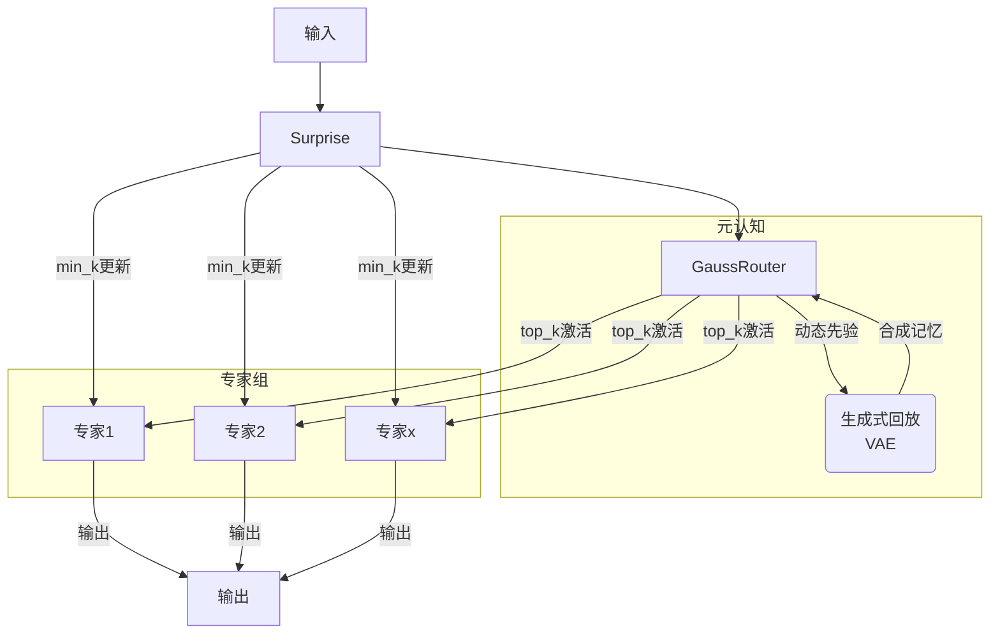

# 预测完整性学习框架（Predictive Integrity Learning Framework, PILF）

[](https://www.gnu.org/licenses/agpl-3.0)
[](https://deepwiki.com/dmf-archive/PILF)

> 不仅要训练你的模型，更要理解它的心智。

<p align="center">
<a href="zoo_zh.md">[模型动物园]</a> | <a href="./readme.md">[English]</a>
</p>

---

**PILF** 是一个认知学习框架，旨在将固定的超参数（如学习率、模型容量）转变为由数据内在“惊奇度”(`Surprise`)实时驱动的动态策略。

它让模型能够：

- **感知价值**：实时评估每个数据批次带来的学习价值。
- **自主决策**：根据价值自主决定“学多少”（学习率）和“用多大容量学”（模型容量）。

该框架的技术和理论基础源于 **[IPWT (Integrated Predictive Workspace Theory)](https://github.com/dmf-archive/IPWT)**。

## 设计哲学：从“固定规则”到“动态策略”

传统训练范式依赖于手动设定的、在整个训练过程中通常固定或按预定计划衰减的超参数（如学习率）。这种“一刀切”的方法忽略了不同数据批次所包含的学习价值的巨大差异。

PILF 的设计哲学是：**用动态的、数据驱动的策略取代静态的、人为设定的规则**。

它不再盲目地使用固定的学习率或固定的模型容量，而是通过实时评估每一批次数据带来的 `Surprise`，动态地、按比例地调整其学习行为。

## 框架



### Surprise-Min-K (SMK)

SMK 是一种促进专家专业化和模型可解释性的自适应方案。它起源于门控反向传播 (GBP)，一种基于 `Surprise` 的硬性门控更新机制，SMK 对此思想进行了改进。在 `top-k` 专家被激活后，系统会计算每个专家的 `Surprise`，并仅保留 `Surprise` 最低的 `min_k` 个专家进行更新。这是神经达尔文主义的数字再现，加速了功能收敛，并强制模型依赖最“自信”的专家。这使得观察不同任务下的专家激活模式变得容易。

### GaussMoE (高斯路由 MoE)

为了解决线性门控的根本缺陷，我们引入了**高斯路由 (Gaussian Routing)**，这是当前研究的核心。它促进了专家的专业化，并且在与 SMK 结合使用时，表现出卓越的专家功能分化。然而，在没有上下文的环境中，它自身无法克服灾难性遗忘。

1. **专家即分布 (Experts as Distributions)**: 每个专家是在输入空间中由一个可学习的高斯分布（由均值 `μ` 和对数标准差 `log_sigma` 参数化）来定义其“知识领域”。
2. **路由即计算概率 (Routing as Probability Calculation)**: 路由过程是计算输入 `x` 在每个专家的高斯分布下的对数概率密度。这个概率反映了输入与专家“知识领域”的匹配程度，从根本上强化了专家的分工和专业化。

### PILR-S/D (预测完整性学习率调度器)

这是一种动态学习率控制机制。不幸的是，它通常会引入更多的超参数，其有效性仍在研究中。与 SMK 的显著效果相比，PILR 在此阶段的贡献不那么引人注目。

## 未来特性

### 记忆高斯路由 MoE

该机制引入了一种新颖的方法，旨在增强知识隔离并在混合专家（MoE）模型中实现自然的梯度正交化。与依赖生成式回放或复杂架构修改的传统方法不同，MemoryGaussianMoE 专注于利用模型自身的历史路由决策。它将每个 MoE 层的历史路由分布（即 `weights`）收集并存储在一个固定大小的缓冲区中，从而形成模型历史专家激活模式的动态表示。

一个新的 `historical_routing_loss` 损失项在反向传播过程中被引入。该损失量化了当前批次的路由分布与聚合后的历史上下文之间的差异。通过引入此损失，路由器的梯度更新不仅受当前任务性能的驱动，还被引导以保持与其过去路由行为的“正交性”或一致性。这使得模型能够在适应新任务的同时，自然地保留先前获得的知识，从而有效缓解灾难性遗忘。

### 动态 Top-K

该机制将根据 `Surprise` 动态调整激活的专家数量 `k` (`k = g(Surprise)`)。简单的任务将需要更少的专家，而复杂的任务则会动态调动更多。由于当前实验规模较小且实现相对简单，此功能尚未实现。

### 动态 Schedules

该机制允许模型根据 PI 分数自行安排学习规划，直到将所有任务的 PI 都最大化为止。模型将回顾过去学习周期中的 ΔACC（准确率变化）和 ΔPI（预测完整性变化），以选择效率最高的学习路径，并确保在完成当前任务的 Grokking 后，能够自主转向复习其他任务。

## 安装与使用

要复现实验并使用完整的测试框架，您必须首先克隆本仓库。

```bash
git clone https://github.com/dmf-archive/PILF.git
cd PILF
```

**注意:** 本包不会自动安装 PyTorch。请在继续之前，为您的系统（CPU 或 CUDA）手动安装合适的版本。对于支持 CUDA 的系统，建议使用 `uv` 或 `pip` 安装：

```bash
# CUDA 12.1 示例
uv pip install torch torchvision torchaudio --index-url https://download.pytorch.org/whl/cu121
```

设置好 PyTorch 后，安装框架的依赖项：

```bash
uv pip install -e .[dev]
```

所有实验都通过唯一的 `train.py` 脚本启动，该脚本由一个**调度文件**和一个**模型配置文件**共同驱动。

| 脚本       | 主要目的           | 示例命令                                                                                 |
| :--------- | :----------------- | :--------------------------------------------------------------------------------------- |
| `train.py` | 运行所有类型的实验 | `python train.py --schedule <schedule_path> --model-config <model_config_path>`          |

---

## 4. 引用

如果您的研究使用了此项目，请引用：

```bibtex
@misc{pilf,
  author   = {Rui, L.},
  title    = {{PILF: Predictive Integrity Learning Framework}},
  year     = {2025},
  publisher= {GitHub},
  url      = {https://github.com/dmf-archive/PILF}
}
```

## 5. 许可证

本项目采用 AGPLv3 许可证。详情请见 `LICENSE` 文件。
