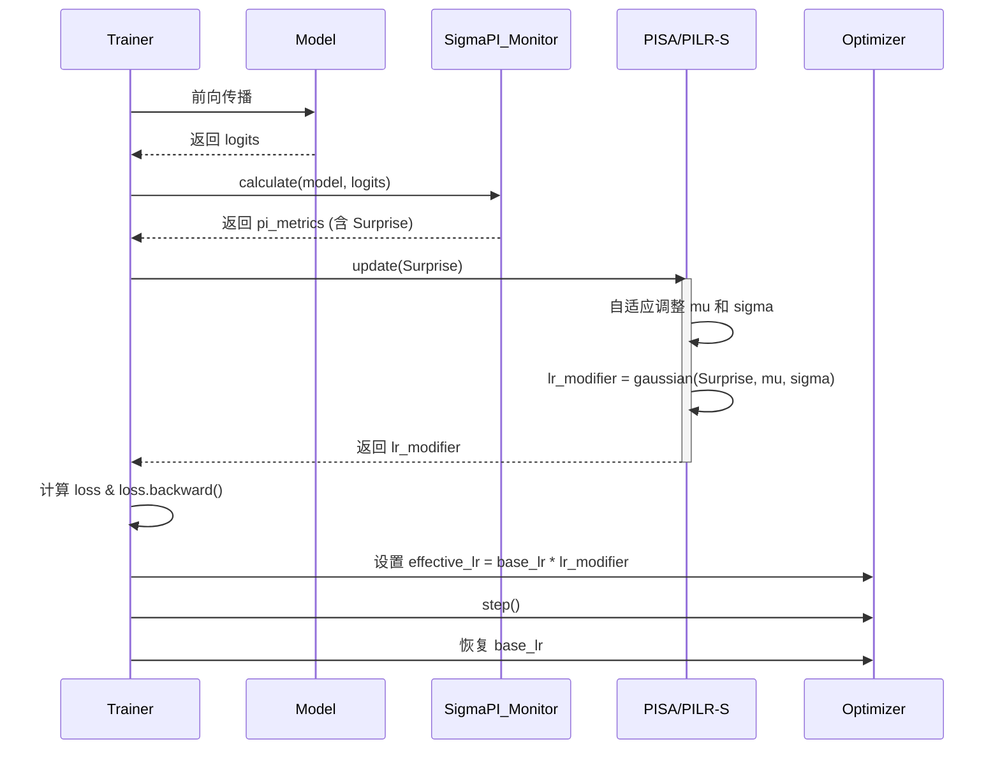
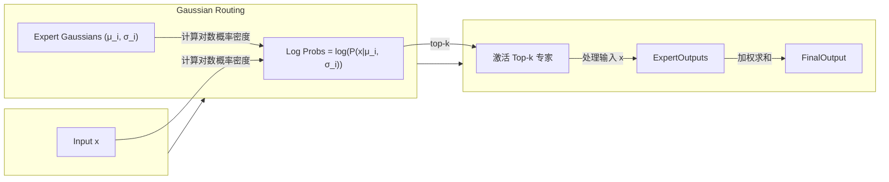
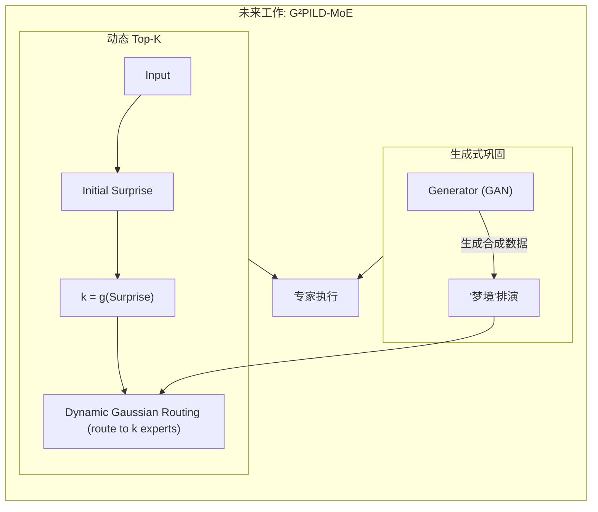

# 预测完整性学习框架（Predictive Integrity Learning Framework, PILF）

[](https://www.gnu.org/licenses/agpl-3.0)
[](https://deepwiki.com/dmf-archive/PILF)

> 不仅要训练你的模型，更要理解它的心智。

<p align="center">
    <a href="docs/zoo_zh.md">[模型动物园]</a> | <a href="./readme.md">[English]</a> 
</p>

---

**PILF** 是一个认知学习框架，旨在将固定的超参数（如学习率、模型容量）转变为由数据内在“惊奇度”(`Surprise`)实时驱动的动态策略。

其核心是一种自适应超参数调度算法，它让模型能够：

- **感知价值**：实时评估每个数据批次带来的学习价值。
- **自主决策**：根据价值自主决定“学多少”（学习率）和“用多大容量学”（模型容量）。

该框架的技术和理论基础源于 **[IPWT (Integrated Predictive Workspace Theory)](https://github.com/dmf-archive/IPWT)**。

## 1. 设计哲学：从“固定规则”到“动态策略”

传统训练范式依赖于手动设定的、在整个训练过程中通常固定或按预定计划衰减的超参数（如学习率）。这种“一刀切”的方法忽略了不同数据批次所包含的学习价值的巨大差异。

PILF 的设计哲学是：**用动态的、数据驱动的策略取代静态的、人为设定的规则**。

它不再盲目地使用固定的学习率或固定的模型容量，而是通过实时评估每一批次数据带来的 `Surprise`，动态地、按比例地调整其学习行为。

## 2. 核心实现：PILF 演进路线图

PILF 的演进分为多个阶段，每个阶段都建立在前一阶段的基础上，逐步实现更高级的自适应能力。

### 阶段零：MoE-GBP (门控反向传播) - [已废弃]

作为 PILF 的思想前身，GBP (Gated Backpropagation) 首先验证了基于 `Surprise` 指标进行选择性学习的有效性。它通过一个简单的二元门控信号来决定是否执行 `optimizer.step()`，从而对高 `Surprise` 的、可能有害的更新进行“硬性”抑制。

- **遇到的问题**: 这种“全或无”的门控过于粗糙，无法实现平滑的、按比例的认知资源调控。
- **演进方向**: 其核心的选择性更新思想，已被后续更精细的 `Surprise-Min-K` 机制所继承和发扬。


### 阶段一：PILR-S (预测完整性驱动的学习率调度器)

这是 PILF 思想在**任何标准神经网络**上的直接应用。它只关注一个问题：**如何根据 `Surprise` 动态调整学习率？**

- **核心机制**: `effective_lr = base_lr * f(Surprise)`。它取代了传统的学习率调度器，通过一个高斯函数 `exp(-0.5 * ((surprise - mu) / sigma)^2)` 计算出一个平滑的调制因子 `lr_modifier`，动态缩放学习率。
- **PISA (预测完整性驱动的 σ 自适应器)**: PILR-S 的核心增强。它将高斯函数中的标准差 `sigma` 从一个固定的超参数转变为一个动态的、自适应的状态变量。`sigma` 的值由 `Surprise` 的二阶统计量（指数移动方差）动态决定，使得模型能够根据所处环境的“混乱程度”自适应地调整其学习的“容忍度”或“开放性”。
- **配置灵活性**: 在当前实现中，通过在配置文件中设置 `beta=0`，可以固定 `sigma`，使 PISA 的行为回退到等效的 PILR-S 模式，这对于最大化特定任务的学习效率非常关键。



### 阶段二：PIL-MoE (线性门控 MoE) - [已废弃]

此阶段尝试将 PILR-S 应用于标准的 Mixture-of-Experts (MoE) 架构，该架构使用一个简单的线性层作为门控网络。

- **遇到的问题**:
  1. **功能分区不显著**: 线性门控过于简单，难以引导专家形成稳定、清晰的功能特化。
  2. **门控网络的灾难性遗忘**: 门控网络本身作为一个小型神经网络，同样遭受灾难性遗忘的困扰。在学习新任务后，它会忘记如何将旧任务的数据路由到正确的专家，导致整个模型性能崩溃。

### 阶段三：GPIL-MoE (高斯路由 MoE) - [当前阶段]

为了解决线性门控的根本缺陷，我们引入了**高斯路由 (Gaussian Routing)**，这是当前研究的核心。

**核心机制: 专家即分布，路由即概率**

1. **专家即分布 (Experts as Distributions)**: 每个专家不再是简单的 MLP，而是在输入空间中由一个可学习的高斯分布（由均值 `μ` 和对数标准差 `log_sigma` 参数化）来定义其“知识领域”。
2. **路由即计算概率 (Routing as Probability Calculation)**: 路由过程不再是简单的线性映射，而是计算输入 `x` 在每个专家的高斯分布下的对数概率密度。这个概率反映了输入与专家“知识领域”的匹配程度，从根本上强化了专家的分工和专业化。
3. **稀疏更新 (Sparse Update)**: 在反向传播时，仅更新被路由到的 `top-k` 个专家的权重（包括其 MLP 层和高斯分布参数 `μ` 和 `log_sigma`）。



**当前成果与机制优势:**

1. **显著的功能分化**: 高斯路由成功地引导了专家网络的自发功能分化。实验（见 `marathon-v3` 系列）清晰地显示，在多任务学习中，不同专家形成了针对特定数据集（如 MNIST vs CIFAR10）的稳定“知识领域”。
2. **一步排演 (1-Step Rehearsal)**: GPIL-MoE 展现了出色的抗遗忘能力。由于功能分化，模型在重新接触旧任务时，只需极少量的“排演”（如一个 epoch），就能迅速重新激活相关专家的知识。这标志着向真正的持续学习迈出了重要一步。
3. **神经达尔文主义剪枝 (Surprise-Min-K)**: 这是对高斯路由的进一步增强，继承并超越了早期 GBP 的思想。在 `top-k` 专家被激活后，系统会计算每个专家的 `Surprise`，并仅保留 `Surprise` 最低的 `min_k` 个专家进行更新。这加速了功能收敛，并强制模型依赖最“自信”的专家，实现了更精细的资源分配和更强的知识巩固。

**局限性：尚未根除的灾难性遗忘**

尽管高斯路由通过功能分化显著**缓解**了灾难性遗忘，但它并**没有完全解决**这个问题。专家的“知识领域”（即其高斯分布的均值 `μ` 和标准差 `σ`）本身仍然是可训练的参数，在学习新任务时，它们依然会受到新数据分布的干扰而发生“漂移”。这就是为什么在未来的 G²PILD-MoE 阶段，我们必须引入一个并行的**生成式记忆系统**（如 GAN），通过“梦境排演”来主动巩固和校准这些知识领域，从而实现真正的持续学习。

### 阶段四：G²PILD-MoE (生成式高斯路由动态 MoE) - [未来方向]

此阶段的目标是实现一个完全自适应的认知系统。

- **核心机制 1: 动态 Top-K**: `k = g(Surprise)`。`Surprise` 不仅调节学习率，还动态缩放激活的专家数量 `k`。简单的任务只需少数专家，复杂的任务则动态调动更多专家，实现计算资源的按需分配。
- **核心机制 2: 生成式记忆巩固**: 引入一个并行的生成模型（GAN），用于生成合成数据进行“梦境排演”，以主动抵抗灾难性遗忘，实现知识的自我巩固，最终建成 G²PIL 架构。



## 3. 安装与使用

本项目依赖 `sigma-pi` 包进行核心计算。要复现实验并使用完整的测试框架，您必须首先克隆本仓库。

```bash
git clone https://github.com/dmf-archive/PILF.git
cd PILF
```

**注意:** 本包不会自动安装 PyTorch。请在继续之前，为您的系统（CPU 或 CUDA）手动安装合适的版本。对于支持 CUDA 的系统，建议使用 `uv` 或 `pip` 安装：

```bash
# CUDA 12.1 示例
uv pip install torch torchvision torchaudio --index-url https://download.pytorch.org/whl/cu121
```

设置好 PyTorch 后，安装框架的依赖项：

```bash
uv pip install -e .[dev]
```

### 3.1. 运行实验

所有实验都通过唯一的 `train.py` 脚本启动，该脚本由一个**调度文件**和一个**模型配置文件**共同驱动。

| 脚本       | 主要目的           | 示例命令                                                                                         |
| :--------- | :----------------- | :----------------------------------------------------------------------------------------------- |
| `train.py` | 运行所有类型的实验 | `python train.py --schedule <schedule_path> --model-config <model_config_path>`                  |
| `train.py` | 运行马拉松复习实验 | `python train.py --schedule schedules/marathon_v3.py --model-config configs/large_gpil_mnist.py` |

---

## 4. 引用

如果您的研究使用了此项目，请引用：

```bibtex
@misc{pilf,
  author       = {Rui, L.},
  title        = {{PILF: Predictive Integrity Learning Framework}},
  year         = {2025},
  publisher    = {GitHub},
  url          = {https://github.com/dmf-archive/PILF}
}
```

## 5. 许可证

本项目采用 AGPLv3 许可证。详情请见 `LICENSE` 文件。
