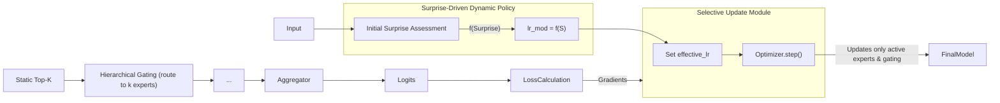
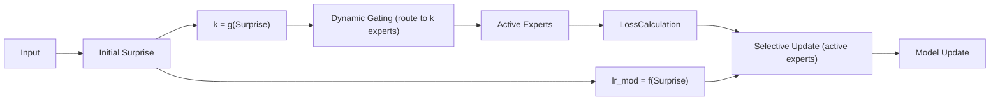
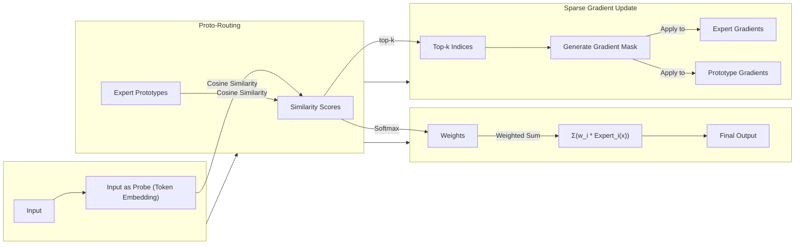

# 预测完整性学习框架（Predictive Integrity Learning Framework, PILF）

> 不仅要训练你的模型，更要理解它的心智。

<p align="center">
  <a href="./readme.md">English</a> | <a href="readme_ZH.md">中文</a> | <a href="zoo.md">Model Zoo (EN)</a> | <a href="zoo_zh.md">模型动物园 (ZH)</a>
</p>

---

核心理念: 一个旨在将固定的超参数（如学习率、模型容量）转变为由数据内在“惊奇度”(`Surprise`)实时驱动的动态策略的认知学习框架。其本质是一种自适应超参数调度算法，它让模型根据学习内容的价值，自主决定“学多少”和“用多大容量学”。该框架源于 IPWT (Integrated Predictive Workspace Theory) 理论，相关论文信息请见 <https://github.com/dmf-archive/IPWT>

## 1. 设计哲学：从“固定规则”到“动态策略”

传统训练范式依赖于手动设定的、在整个训练过程中通常固定或按预定计划衰减的超参数（如学习率）。这种“一刀切”的方法忽略了不同数据批次所包含的学习价值的巨大差异。

PILF 的设计哲学是：**用动态的、数据驱动的策略取代静态的、人为设定的规则**。

它不再盲目地使用固定的学习率或固定的模型容量，而是通过实时评估每一批次数据带来的 `Surprise`，动态地、按比例地调整其学习行为：

1. **动态学习率 (Dynamic Learning Rate)**: 当 `Surprise` 适中时，意味着遇到了有价值的“可学习区”信息，系统会分配较高的学习率；当 `Surprise` 过低（冗余信息）或过高（异常信息）时，则分配接近于零的学习率，从而自然地实现了“忽略”和“拒绝”的效果。**这直接取代了手动设定的学习率调度器**。
2. **动态容量 (Dynamic Capacity)**: 在 MoE 架构中，`Surprise` 不仅调节学习率，还决定了需要激活的“专家”数量 `k`。简单的任务 (`Surprise` 低) 只需少数专家，而复杂的任务 (`Surprise` 高) 则会动态调动更多专家参与。**这取代了固定的 Top-K 路由**。

## 2. 核心实现：PILF 的演进阶段

PILF 的演进分为五个主要阶段，每个阶段都建立在前一阶段的基础上，逐步实现更高级的自适应能力：

### 阶段零：MoE-GBP (门控反向传播)

在传统训练中，通过门控机制选择性地更新权重，以缓解灾难性遗忘。`optimizer.step()` 的执行由一个二元门控信号控制，该信号基于`Surprise`指标。作为 PILF 的前身，验证了基于 PI 进行选择性学习的有效性，为后续的动态学习率和容量调度奠定了基础。


### 阶段一：PILR-S (预测完整性驱动的学习率调度器)

PILR-S 是 PILF 思想在**任何标准神经网络**上的直接应用。它只关注一个问题：**如何根据 `Surprise` 动态调整学习率？** 这是通过核心计算工具包 [SigmaPI](https://github.com/dmf-archive/SigmaPI) 实现的。

它取代了传统的 `optimizer.step()` 是否执行的“门控”逻辑，演变为一个平滑的、连续的学习率调制器。


**机制详解:**

1. **`Surprise` 计算**: 目前我们使用反向传播梯度范数来计算，但未来，完全可以考虑将 Forward Forward 累积梯度作为 surprise 的来源。这个过程无需等待昂贵的反向传播，实现了对学习价值的快速评估。
2. **动态调制**: PILR-S 模块接收 `Surprise`，并根据其与 `Surprise` 的指数移动平均（EMA）和标准差（std）的关系，通过一个高斯函数 `exp(-0.5 * ((surprise - mu) / sigma)^2)` 计算出一个平滑的调制因子 `lr_modifier` (范围在 0 到 1 之间)。
3. **权重更新**: 在计算出 `lr_modifier` 后，才执行标准的 `loss.backward()`。随后，`optimizer` 使用 `effective_lr = base_lr * lr_modifier` 来执行权重更新。`optimizer.step()` **总是被执行**，但其更新的幅度已被 `Surprise` 预先动态缩放。

### 阶段二：PIL-MoE (预测完整性学习驱动的 MoE - 静态 Top-K)

**目标:** 将 PILR-S 的动态学习率机制引入 MoE 架构，并结合静态 Top-K 硬路由，同时只更新激活的专家权重。

**核心机制:** `effective_lr = base_lr * f(Surprise)` 应用于 MoE 架构。门控网络根据静态 Top-K 值将任务路由到专家，且仅更新被激活的专家权重。



### 阶段三：PILD-MoE (Predictive Integrity-driven Dynamic Mixture of Experts)

**目标:** 实现一个完全自适应的认知系统，其中 `Surprise` 不仅调节学习率，还动态缩放激活的专家数量 `k`。

**核心机制:** `k = g(Surprise)` 和 `effective_lr = base_lr * f(Surprise)` 并行运作。模型根据数据复杂性动态调整激活的专家数量和学习强度。

**优势:** 实现了计算效率和模型容量扩展性的最大化，真正实现了计算资源按需分配。



### 阶段四：G²PIL (Generative Gaussian Predictive Integrity Learning) 

**目标：** 构建一个完全自组织、自我巩固、自我演化的认知架构，实现从“被动学习”到“主动创造”的终极飞跃。我们当前正处于该阶段的早期，专注于实现其核心的路由机制。

**核心机制 (当前实现): Proto-Routing**

我们用一种基于“原型”的路由机制取代了传统的线性门控，这是迈向 G²PIL 的第一步。

1. **专家原型 (Expert Prototypes)**: 每个专家在共享的嵌入空间中拥有一个可学习的“原型”向量，代表其“知识领域”。
2. **输入探针 (Input Probe)**: 输入 token 的嵌入直接作为“探针”。
3. **路由即匹配 (Routing as Matching)**: 路由过程是计算探针与所有原型之间的余弦相似度。
4. **软决策，稀疏更新 (Soft Decision, Sparse Update)**:
   - **前向传播 (Soft Decision)**: 使用`softmax`将相似度转换为权重，最终输出是**所有**专家输出的加权和，保证了梯度的平滑流动。
   - **反向传播 (Sparse Update)**: 只更新与输入最相似的`top-k`个专家的权重（包括其 MLP 层和原型向量），迫使专家形成功能分区，利于知识沉淀。



**未来方向 (G²PIL 的完整愿景):**

1. **高斯场域认知空间 (Gaussian Field Cognitive Space):**
   - 将离散的原型向量升级为高斯概率分布，实现更平滑的概率性路由。
2. **生成式记忆巩固 (Generative Memory Consolidation):**
   - 引入一个并行的生成模型，用于生成合成数据进行“梦境排演”，以抵抗灾难性遗忘，实现知识的自我巩固。(尚未进行)

## 3. 安装与使用

本项目依赖 `sigma-pi` 包进行核心计算。要复现实验并使用完整的测试框架，您必须首先克隆本仓库。

```bash
git clone https://github.com/dmf-archive/PILF.git
cd PILF
```

**注意:** 本包不会自动安装 PyTorch。请在继续之前，为您的系统（CPU 或 CUDA）手动安装合适的版本。对于支持 CUDA 的系统，建议使用 `uv` 或 `pip` 安装：

```bash
# CUDA 12.1 示例
uv pip install torch torchvision torchaudio --index-url https://download.pytorch.org/whl/cu121
```

设置好 PyTorch 后，安装测试框架的依赖项：

```bash
pip install -e .[dev]
```

测试框架是模块化和配置驱动的。

### 3.1. 配置您的实验

在 `configs/` 目录中创建或修改一个配置文件。例如, `configs/base_vit.py`:

```python
# test/configs/base_vit.py

# 模型参数
model_config = {
    'model_type': 'base',
    'embed_dim': 128,
    'depth': 6,
    # ... 其他模型参数
}

# 训练参数
train_config = {
    'epochs': 20,
    'batch_size': 256,
    # ... 其他训练参数
}
```

### 3.2. 运行实验

从根目录使用 `run_experiment.py` 脚本启动实验：

```bash
python test/run_experiment.py --config test/configs/base_vit.py
```

要运行其他变体，只需指向它们各自的配置文件：

```bash
# 运行 MoE-ViT 实验
python run_experiment.py --config configs/moe_vit.py

# 运行 PILR-S-MoE-ViT 实验
python run_experiment.py --config configs/gbp_moe_vit.py
```

---

本项目采用 AGPLv3 许可证。详情请见 `LICENSE` 文件。
