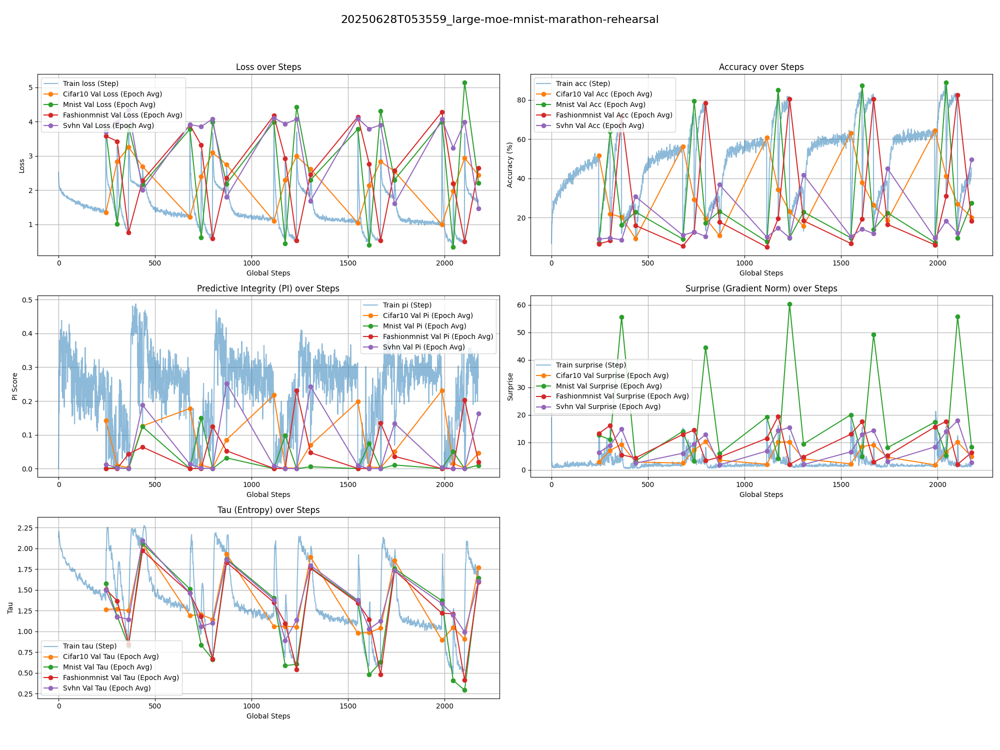
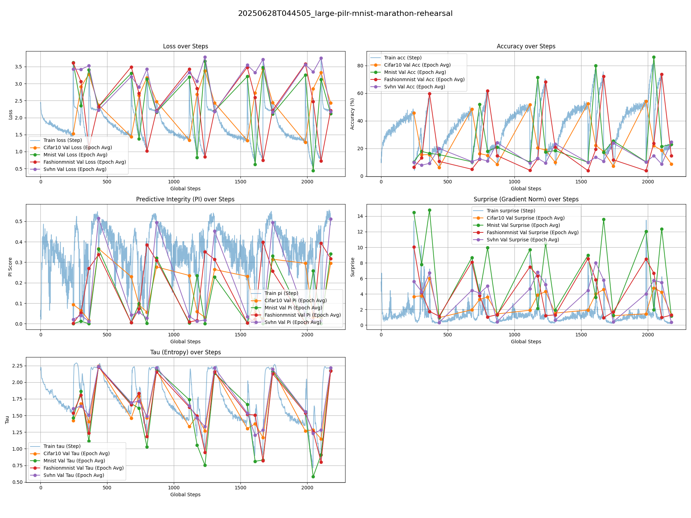
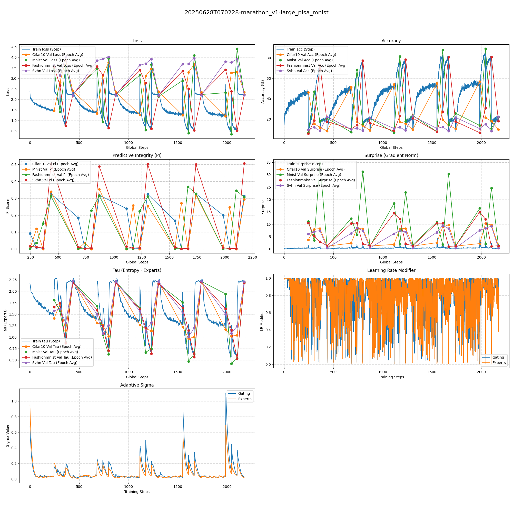

# Model Zoo and Experiments

Our test suite is now built around a lightweight (~1M parameters) Vision Transformer architecture to facilitate rapid experimentation with cognitive learning principles. We compared three main variants on the CIFAR-10 dataset, using SVHN as an out-of-distribution (OOD) validation set.

The goal is to observe the performance of different learning strategies under resource constraints, thereby more clearly demonstrating the advantages of mechanisms like PILR-S (Predictive Integrity Learning Rate Scheduler).

| **Baseline ViT** | **4x1 MoE-ViT** | **16x4 MoE-ViT** | **16x4 PILR-S-MoE-ViT with 3σ Learning** |
| :--:| :--:| :--:| :--:|
| ~0.81M | ~1.21M | ~1.23M | ~1.23M |
|  |  |  |  |

### MNIST Spaced Rehearsal Experiments

We also conducted spaced rehearsal experiments on the MNIST and FashionMNIST datasets to further explore continuous learning capabilities.

| **8x2 Full (FashionMNIST -> MNIST)** | **8x2 Pre-trained + 8x2 PILR-S Spaced Rehearsal (FashionMNIST -> MNIST)** | **8x2 PILR-S Full (FashionMNIST -> MNIST) (1.2σ)** |
| :--:| :--:| :--:|
| ~0.26M | ~0.26M | ~0.26M |
|  |  |  |

### Marathon Rehearsal Experiments v1

A more demanding experimental setup involving cyclical rehearsal across four datasets: CIFAR-10, MNIST, FashionMNIST, and SVHN, in a `5 * (5+1+1+1)` epoch schedule. This tests the model's ability to handle catastrophic forgetting and adapt to different data distributions over a prolonged training period.

| **16x4 MoE Marathon** | **16x4 PILR-S MoE Marathon** | **16x4 PISA MoE Marathon** |
| :--:| :--:| :--:|
| ~0.46M | ~0.46M | ~0.46M |
|  |  |  |

### Marathon Rehearsal Experiments v2

A more challenging setup with a `5 * (4+2+3+5)` schedule, increasing the training focus on more complex datasets (CIFAR-10, SVHN).

| **16x4 MoE Marathon v2** | **16x4 PILR-S MoE Marathon v2** | **16x4 PISA MoE Marathon v2** |
| :--:| :--:| :--:|
| ~0.46M | ~0.46M | ~0.46M |
| *TBD* | *TBD* | *TBD* |
