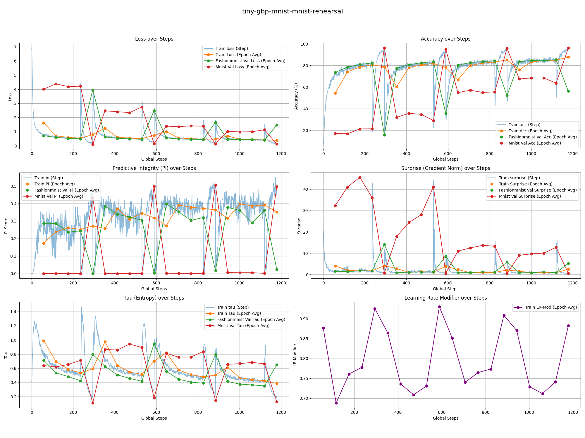
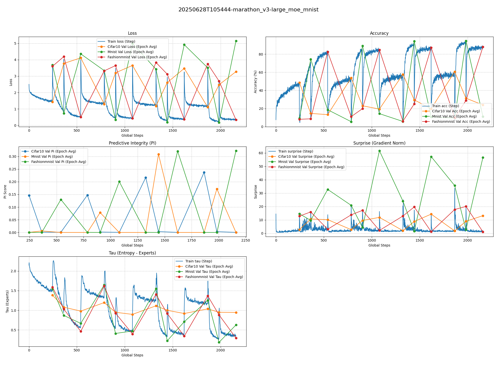
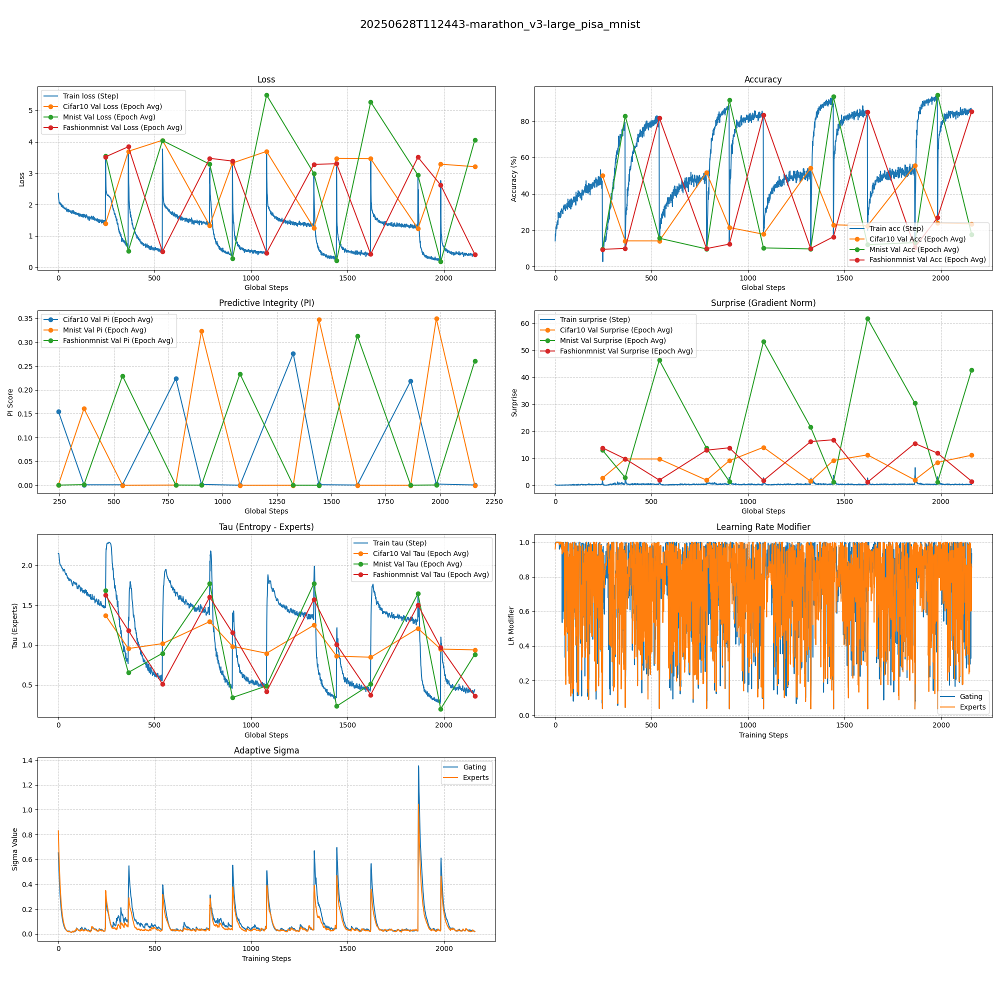
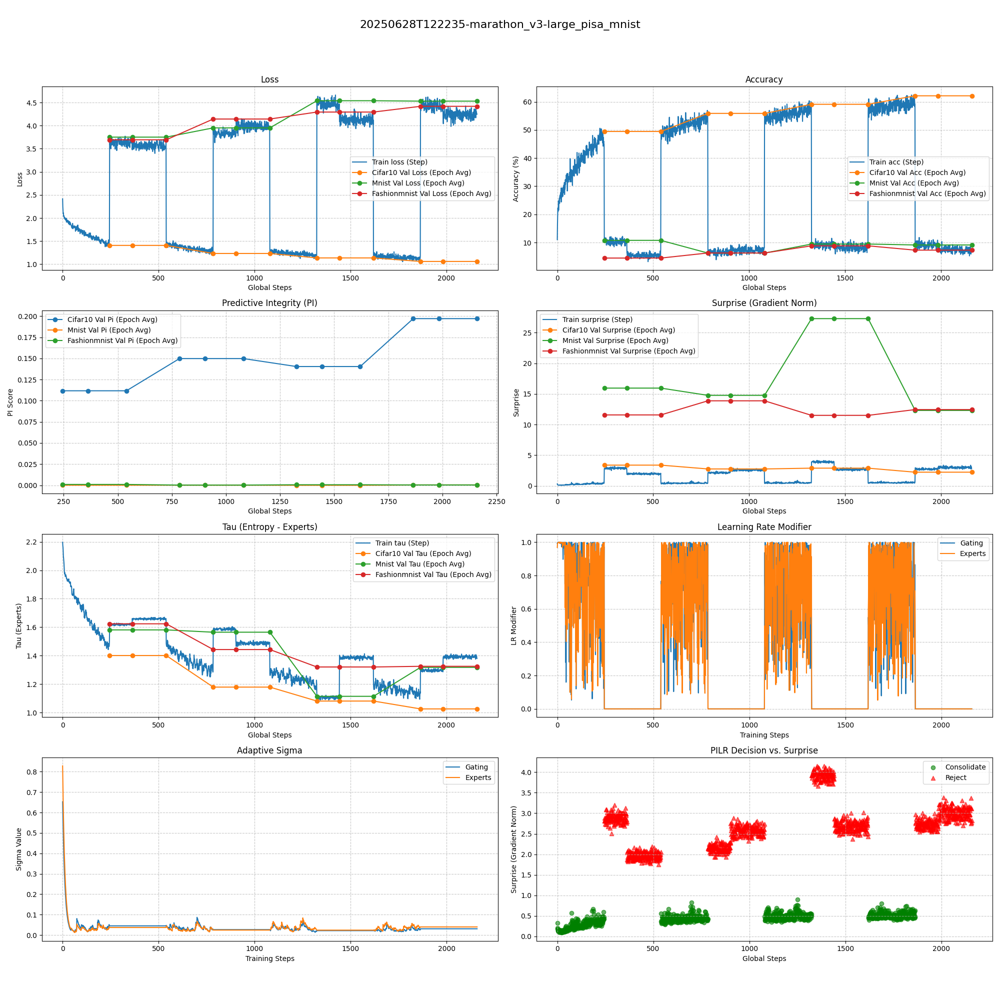
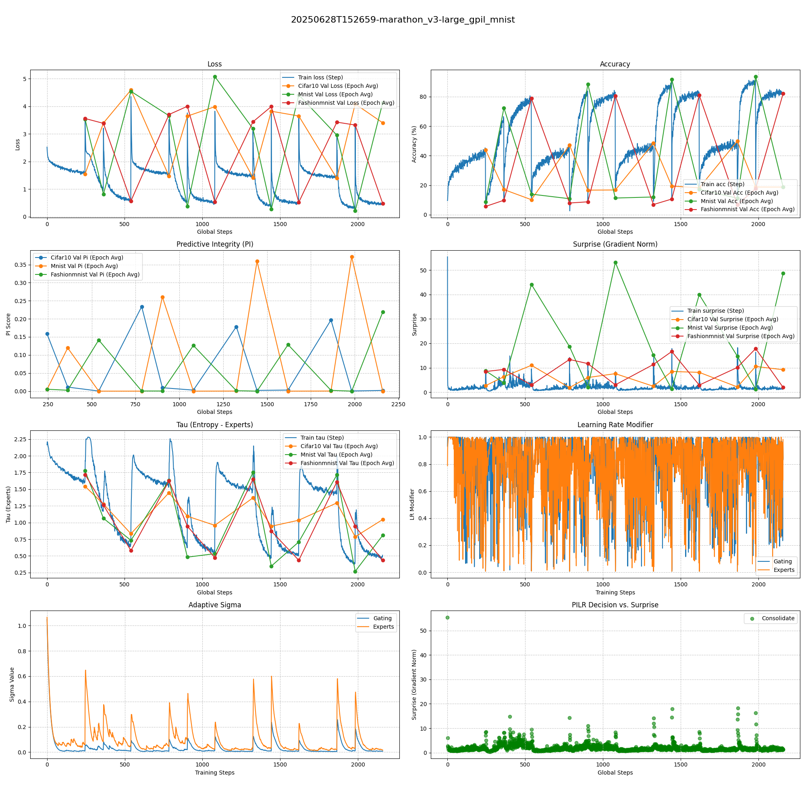
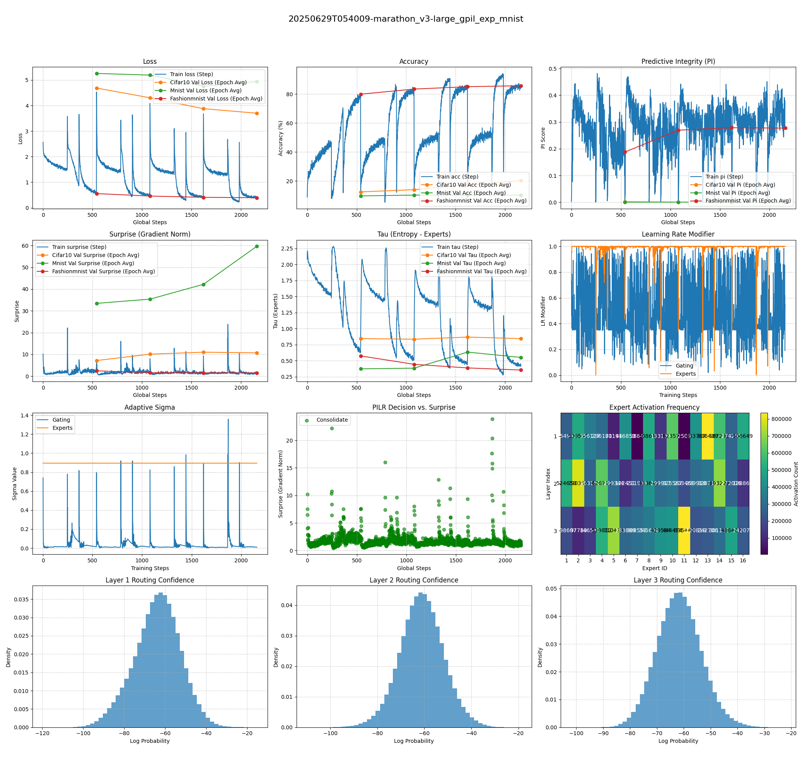
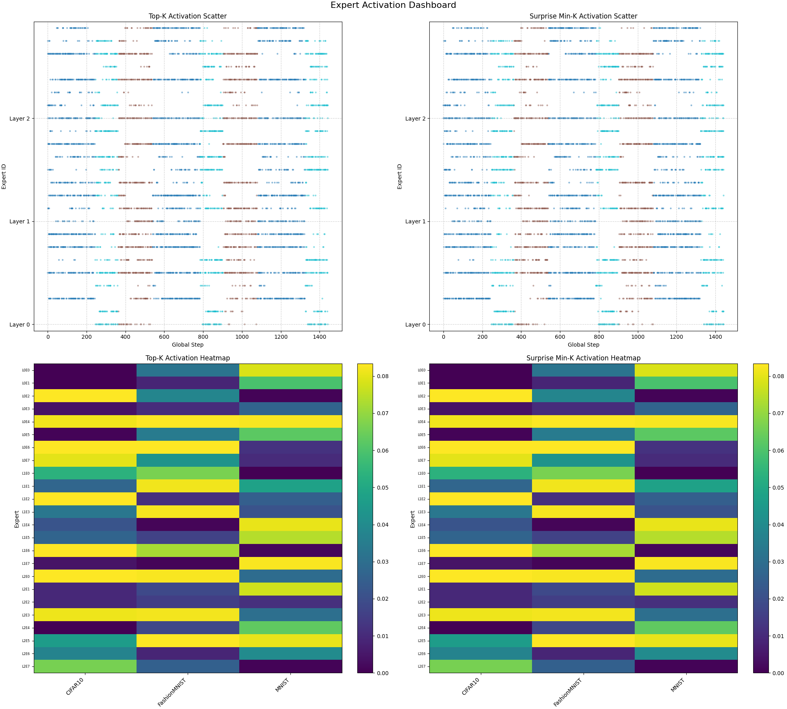
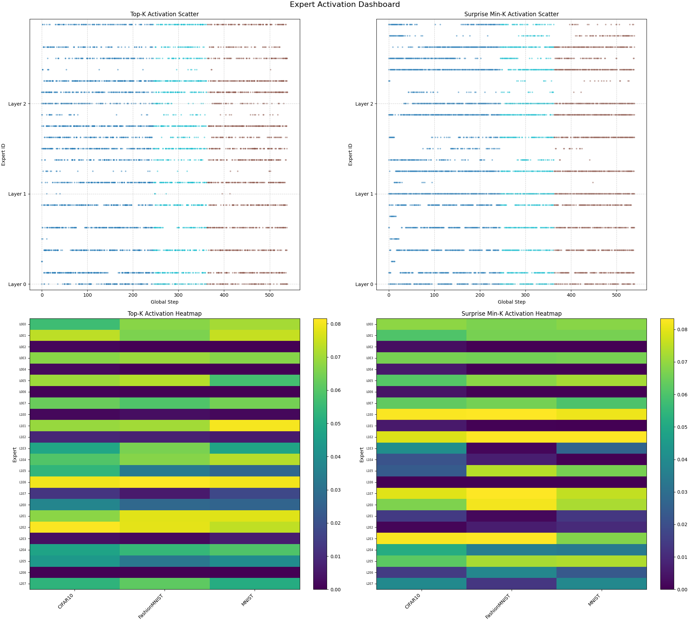

# Model Zoo and Experiments

Our test suite is now built around a lightweight Vision Transformer architecture to facilitate rapid experimentation with cognitive learning principles.

The goal is to observe the performance of different learning strategies under resource constraints, thereby more clearly demonstrating the advantages of mechanisms like PILR-S (Predictive Integrity Learning Rate Scheduler).

### MNIST Spaced Rehearsal Experiments

We also conducted spaced rehearsal experiments on the MNIST and FashionMNIST datasets to further explore continuous learning capabilities.

| **8x2 Full (FashionMNIST -> MNIST)** | **8x2 Pre-trained + 8x2 PILR-S Spaced Rehearsal (FashionMNIST -> MNIST)** | **8x2 PILR-S Full (FashionMNIST -> MNIST) (1.2σ)** |
| :--:| :--:| :--:|
| ~0.26M | ~0.26M | ~0.26M |
|  |  |  |

### Marathon Rehearsal Experiments v3

A marathon rehearsal experiment without SVHN, following a `4 * (5+2+3)` epoch schedule.

| **16x4 MoE** | **16x4 PISA MoE** | **16x4 PISA+GBP (1.2σ)** | **16x4 GPIL-MoE** | **16x4 GPIL-EXP** |
| :--:| :--:| :--:| :--:| :--:|
| ~0.46M | ~0.46M | ~0.46M | ~0.46M | ~0.46M |
|  |  |  |  |  |

### Gating Transformer Routing Experiments

*Note: Gemini's code generation suffers from severe hallucinations, incorrectly refactoring the correct Gaussian routing into a linear version.*

| **Gaussian Transformer Routing** | **Linear Transformer Routing** |
| :--:| :--:|
|  |  |
