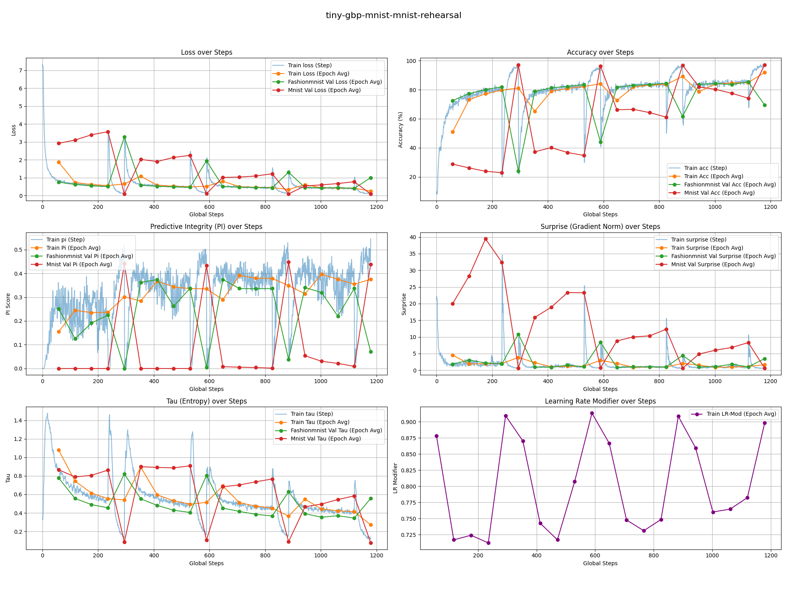
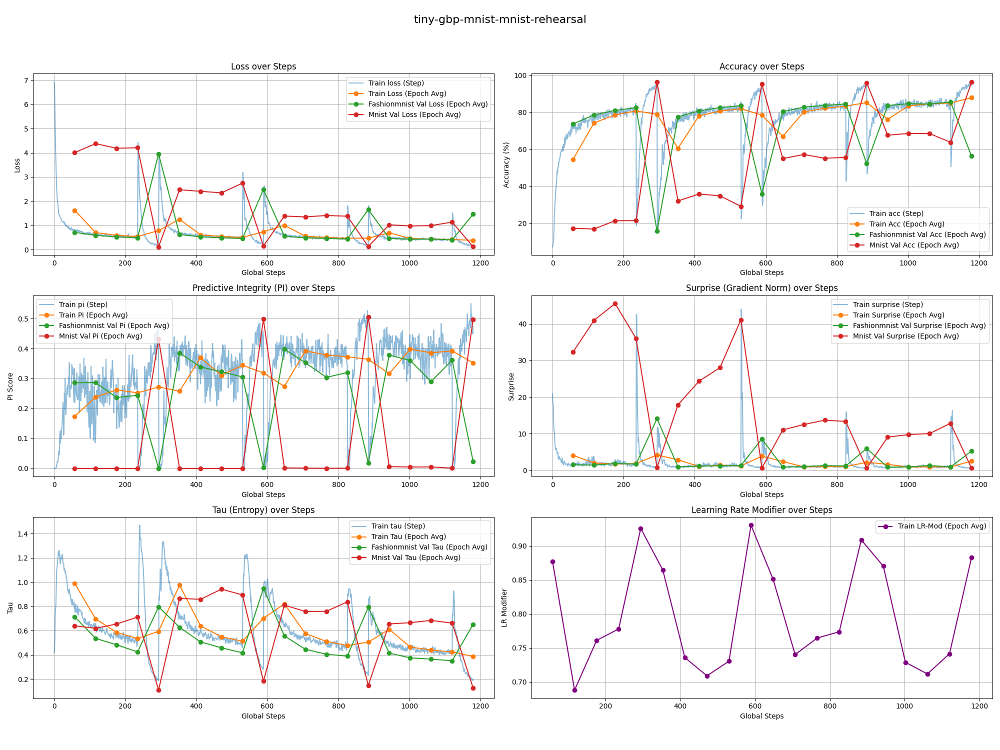
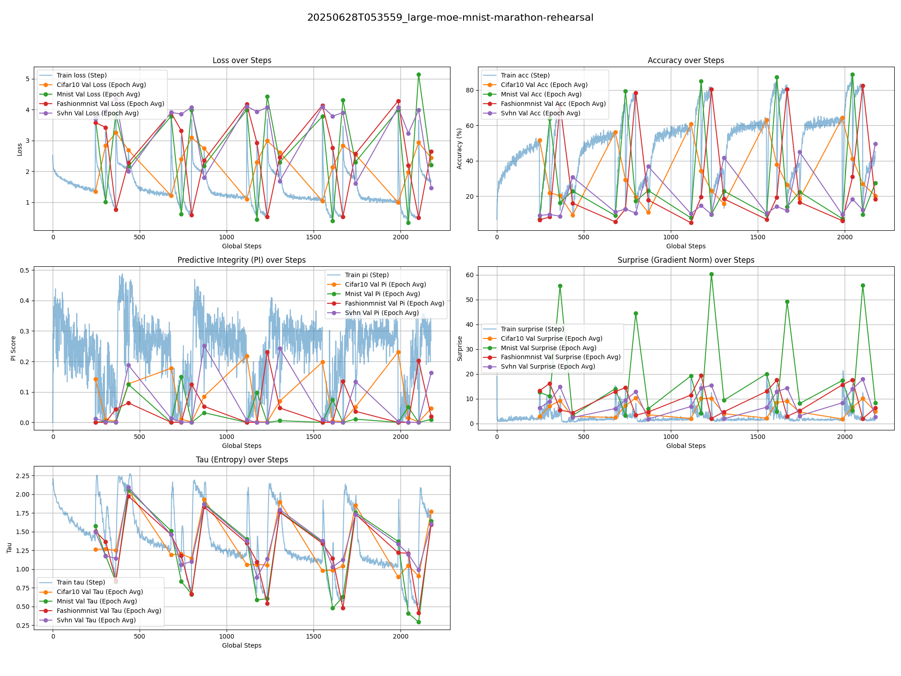
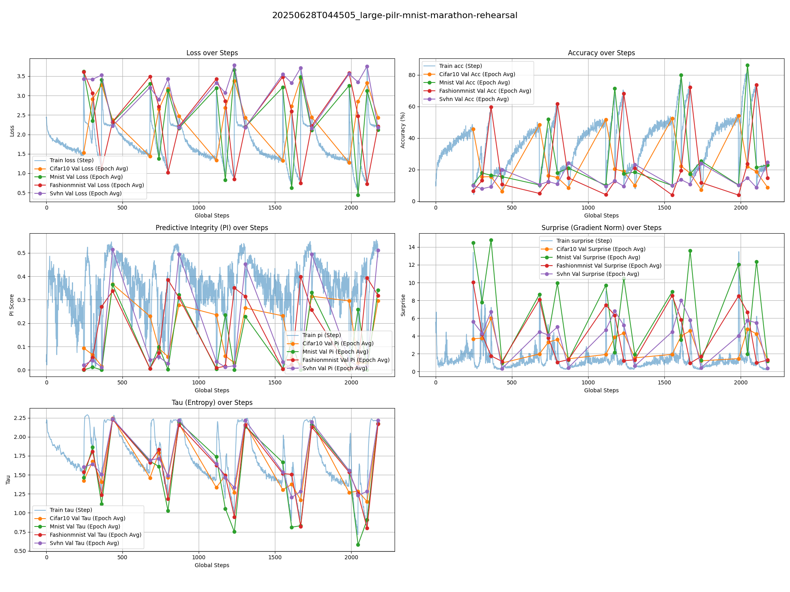
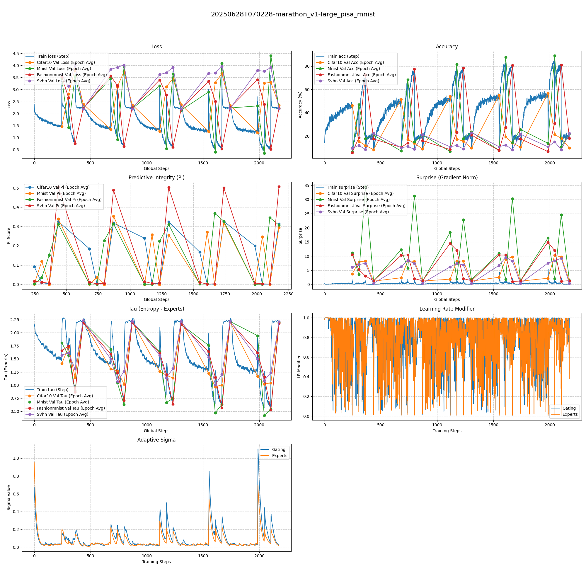
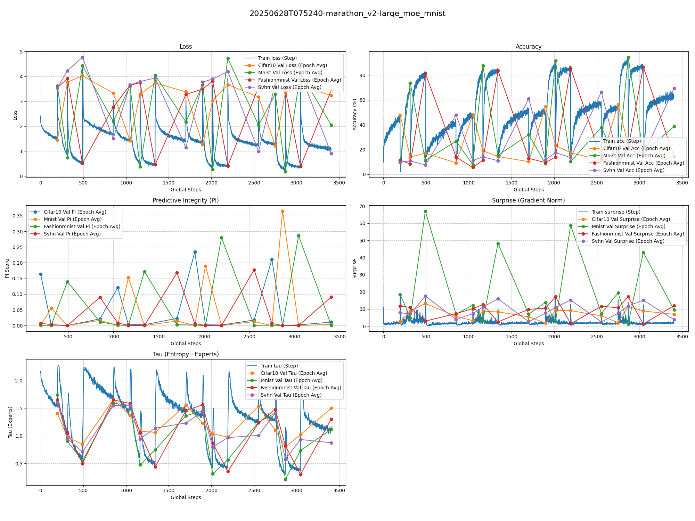
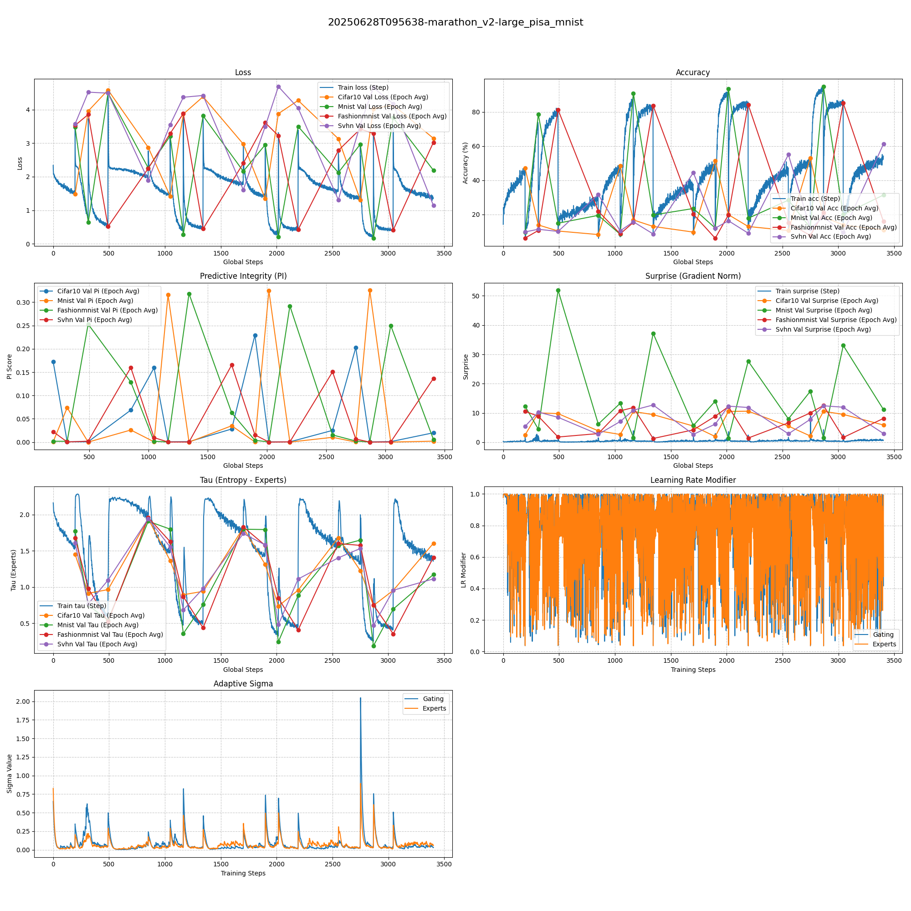
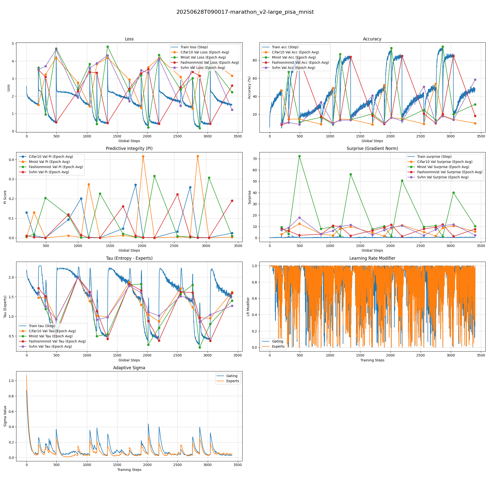
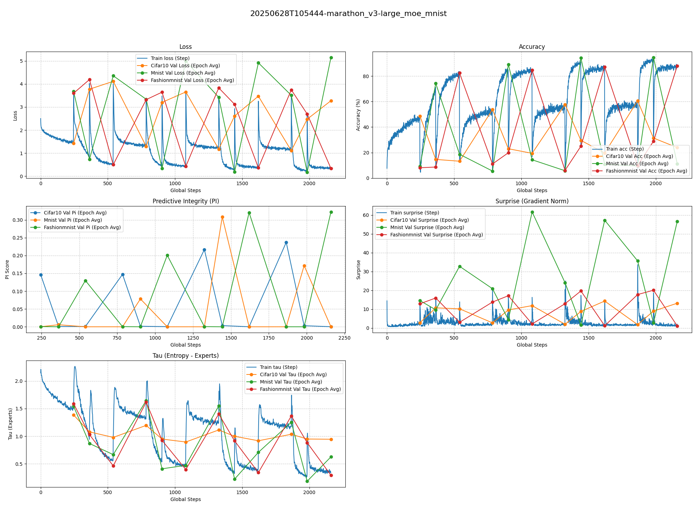
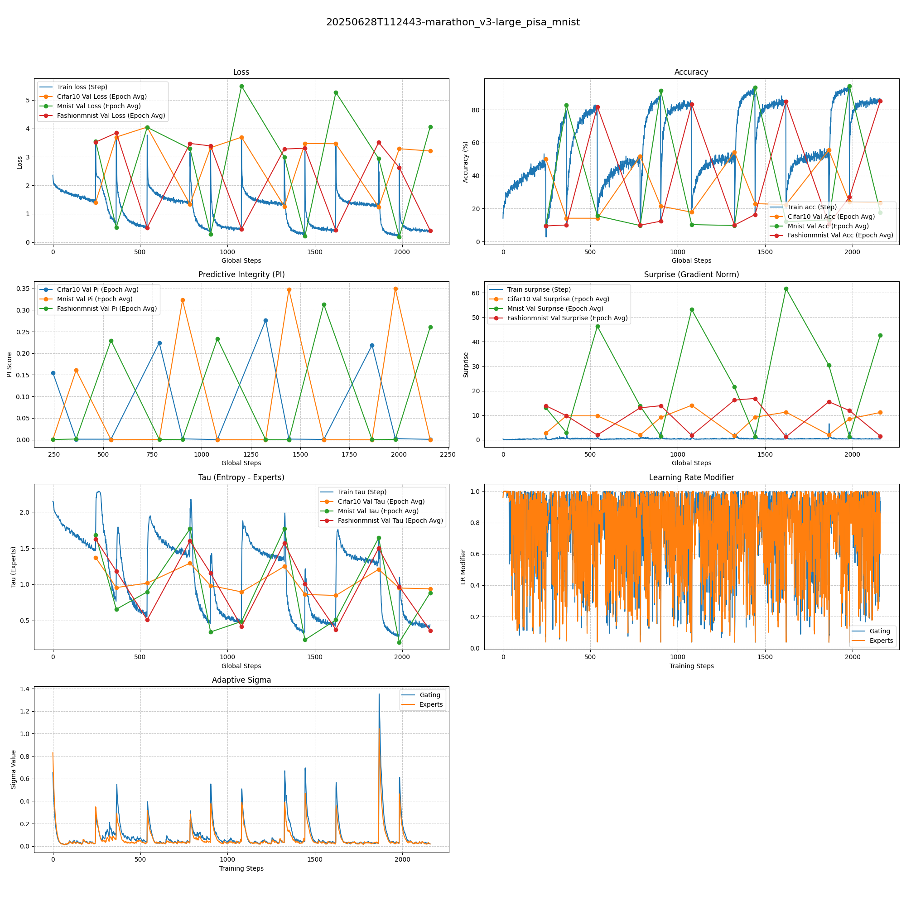

# 模型动物园与实验

我们的测试套件现在围绕一个轻量级的 Vision Transformer 架构构建，以便于快速进行认知学习原理的实验。

目标是观察不同学习策略在资源受限下的表现，从而更清晰地展示 PILR-S（Predictive Integrity Learning Rate Scheduler）等机制的优势。

### MNIST 间隔复习实验

我们还在 MNIST 和 FashionMNIST 数据集上进行了间隔复习实验，以进一步探索持续学习的能力。

|  **8x2 全程 (FashionMNIST -> MNIST)**   |  **8x2 预训练 + 8x2 PILR-S 间隔复习 (FashionMNIST -> MNIST)**   |**8x2 PILR-S 全程 (FashionMNIST -> MNIST) (1.2σ)** |
| :-----: | :-----: | :-------: |
| ~0.26M  | ~0.26M  |  ~0.26M   |
|  |  |  |

### 马拉松复习实验 v1

一个更严苛的实验设置，涉及在四个数据集（CIFAR-10、MNIST、FashionMNIST 和 SVHN）之间进行循环复习，遵循 `5 * (5+1+1+1)` 的周期计划。该实验旨在测试模型在长时间训练中处理灾难性遗忘和适应不同数据分布的能力。遗憾的是，由于赛程设置不当，效果并不突出。

| **16x4 MoE** | **16x4 PILR-S MoE** | **16x4 PISA MoE** |
| :--:| :--:| :--:|
| ~0.46M | ~0.46M | ~0.46M |
|  |  |  |

### 马拉松复习实验 v2

一个更具挑战性的设置，采用 `5 * (4+2+3+5)` 的周期计划，增加了对更复杂数据集（CIFAR-10, SVHN）的训练比重。

| **16x4 MoE ** || **16x4 PISA MoE ** | **16x4 PISA-2 MoE** |
| :--:| :--:| :--:|
| ~0.46M | ~0.46M | ~0.46M | ~0.46M |
|  |  |  |

### 马拉松复习实验 v3

一个不含 SVHN 的马拉松复习实验，采用 `4 * (5+2+3)` 的周期计划。

| **16x4 MoE ** | **16x4 PISA MoE** |
| :--:| :--:|
| ~0.46M | ~0.46M |
|  |  |
