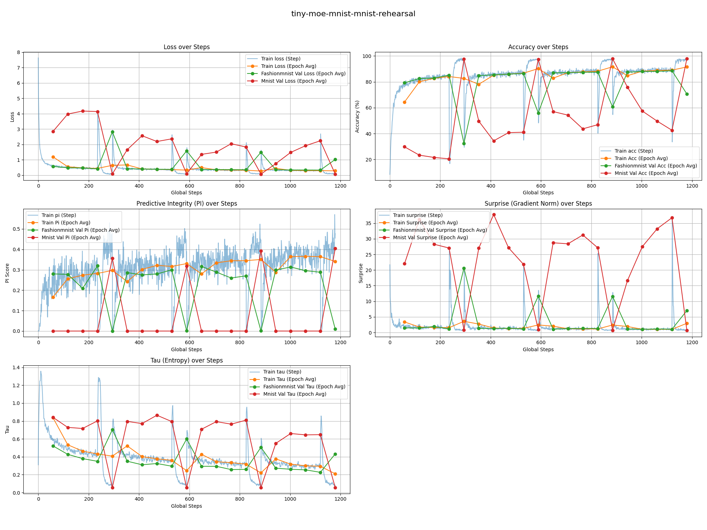
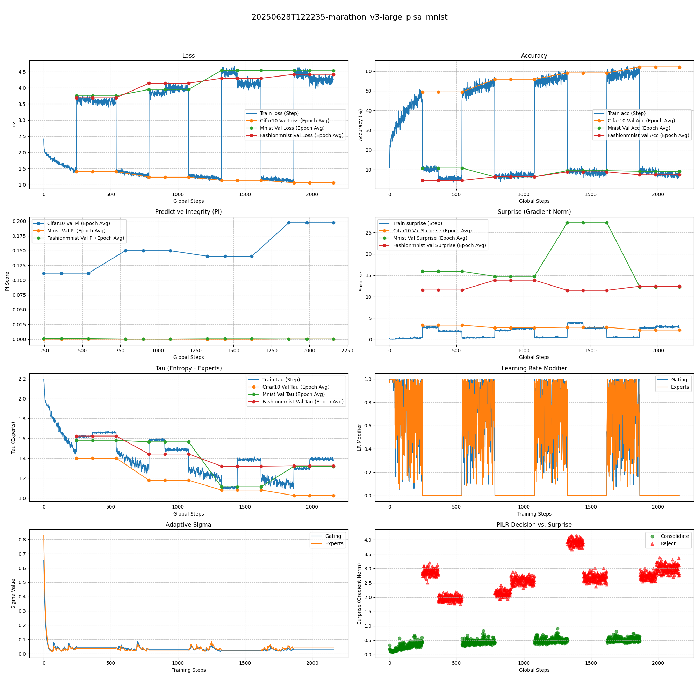
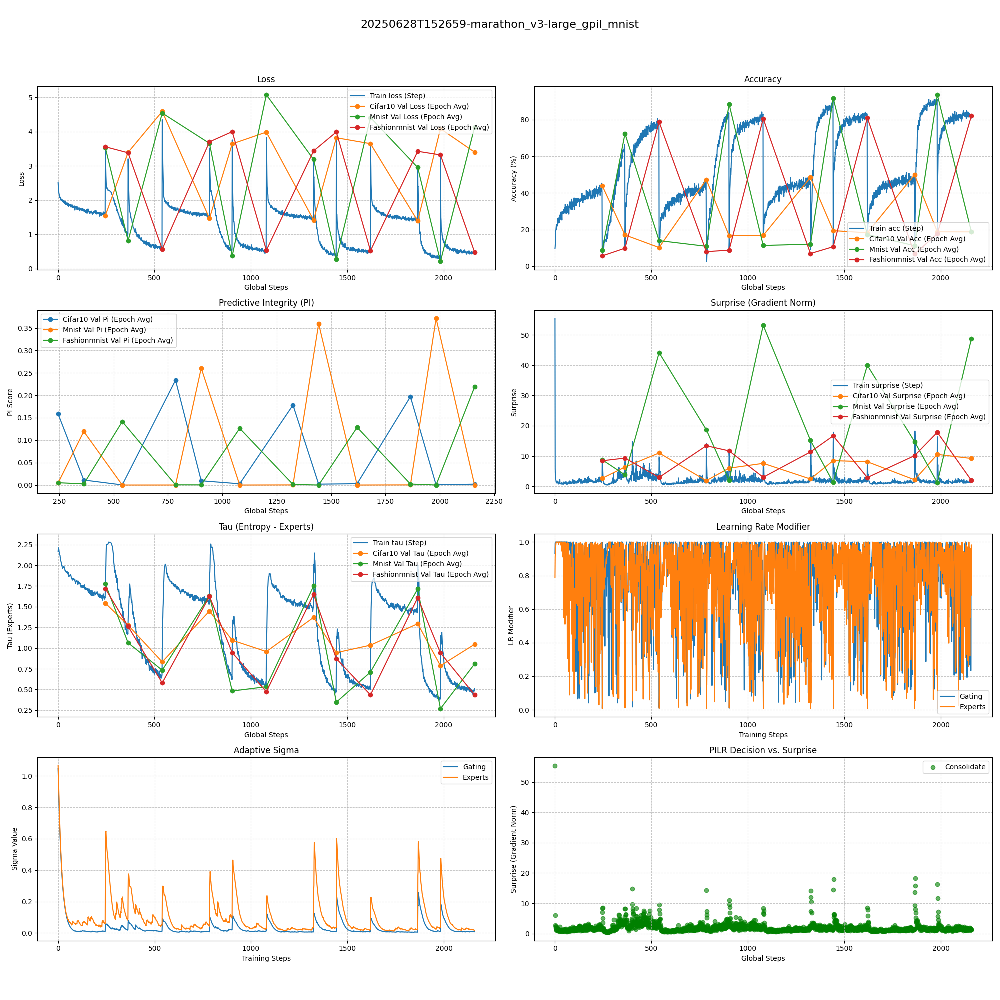
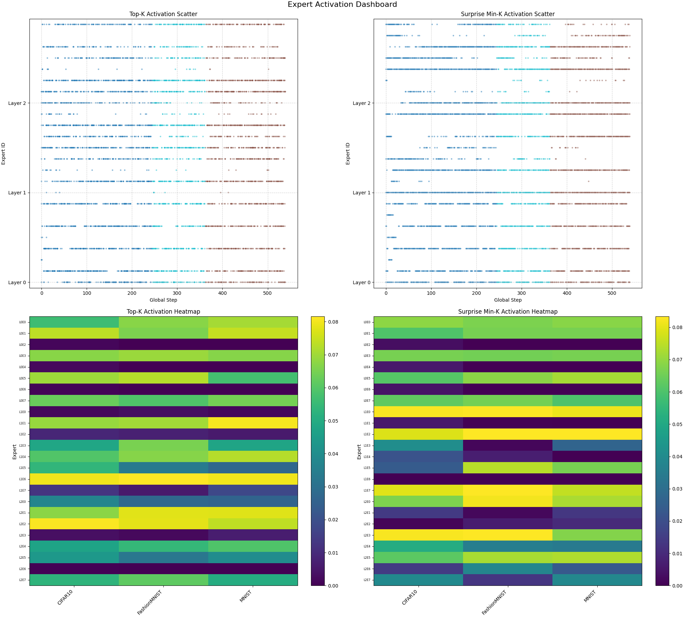

# 模型动物园与实验

我们的测试套件现在围绕一个轻量级的 Vision Transformer 架构构建，以便于快速进行认知学习原理的实验。

目标是观察不同学习策略在资源受限下的表现，从而更清晰地展示 PILR-S（Predictive Integrity Learning Rate Scheduler）等机制的优势。

### MNIST 间隔复习实验

我们还在 MNIST 和 FashionMNIST 数据集上进行了间隔复习实验，以进一步探索持续学习的能力。

|  **8x2 全程 (FashionMNIST -> MNIST)**   |  **8x2 预训练 + 8x2 PILR-S 间隔复习 (FashionMNIST -> MNIST)**   |**8x2 PILR-S 全程 (FashionMNIST -> MNIST) (1.2σ)** |
| :-----: | :-----: | :-------: |
| ~0.26M  | ~0.26M  |  ~0.26M   |
|  |  |  |

### 马拉松复习实验 v3

一个不含 SVHN 的马拉松复习实验，采用 `4 * (5+2+3)` 的周期计划。

| **16x4 MoE** | **16x4 PISA MoE** | **16x4 PISA+GBP (1.2σ)** | **16x4 GPIL-MoE** | **16x4 GPIL-EXP** |
| :--:| :--:| :--:| :--:| :--:|
| ~0.46M | ~0.46M | ~0.46M | ~0.46M | ~0.46M |
|  |  |  |  |  |

### 门控 Transformer 路由实验

*备注：Gemini 的代码生成存在严重幻觉，将原本正确的高斯路由重构为了线性版本。*

| **高斯 Transformer 路由** | **线性 Transformer 路由** |
| :--:| :--:|
|  |  |
